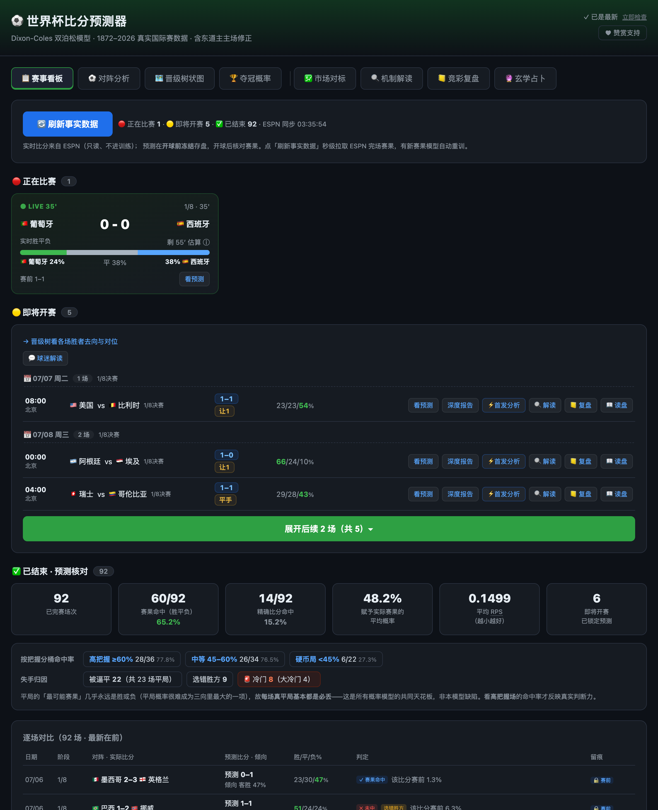
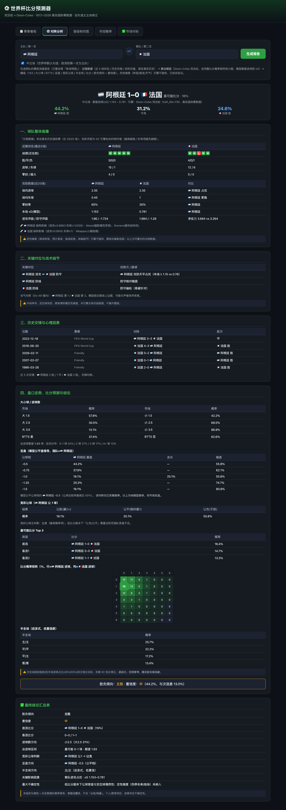
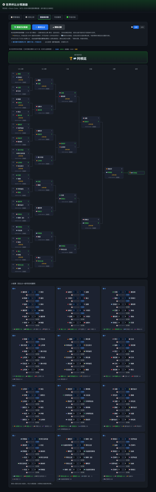
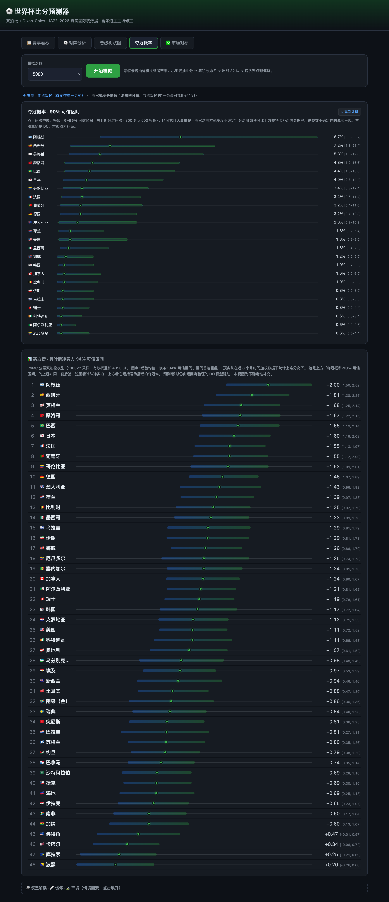
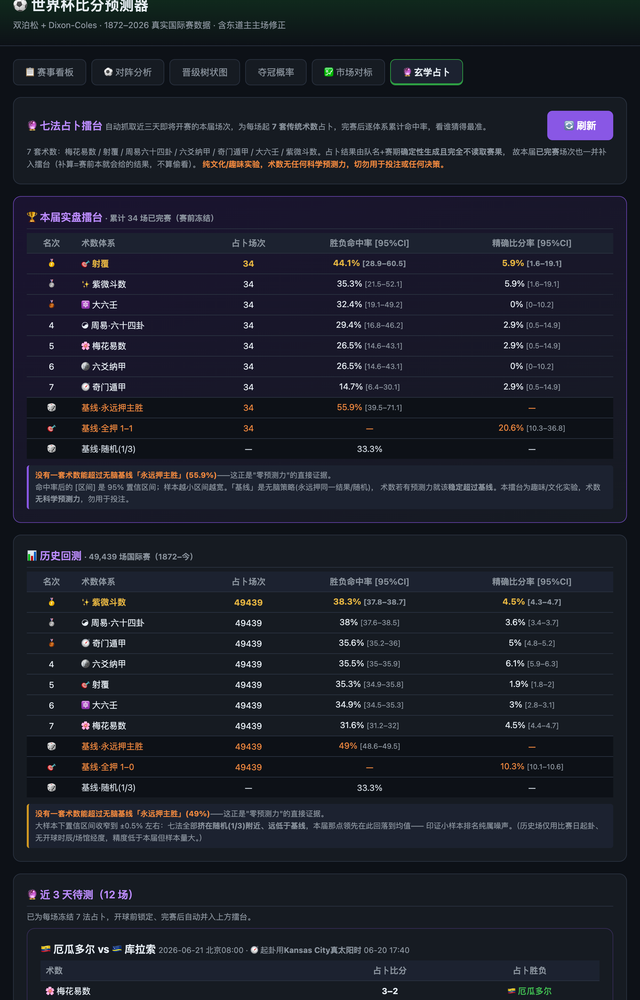
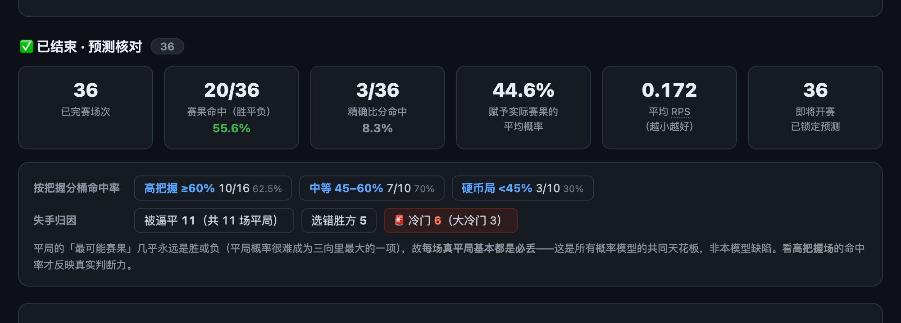

# ⚽ World Cup Score Predictor · 世界杯比分预测器

<p align="right"><strong>English</strong> · <a href="./README.zh-CN.md">简体中文</a></p>

> ## ⚠️ Disclaimer / 免责声明
> This is a **personal, educational open-source project** for statistical modeling, data analysis, and programming study only. It is **not** betting, investment, or any other advice. The author accepts **no liability** for anyone's use of it or for **any gambling/betting activity directly or indirectly associated with it**. All outputs are probabilistic estimates — **probability is not certainty**; gambling is negative-EV for most people over time and is legally restricted in many jurisdictions. You bear **all** risk and legal responsibility. Provided "as is" without warranty; using it means you have read and accepted this notice.
>
> *本项目为**个人学习与技术研究的开源作品**，仅用于统计建模、数据分析与编程学习，**不构成任何形式的投注、投资或决策建议**。作者不对任何人使用本项目、以及由此**直接或间接关联的任何赌球、博彩等行为及其后果**承担任何责任。概率不等于确定结果；博彩长期对绝大多数人 EV 为负且多地受法律限制。一切风险与法律责任由使用者自负。按"现状"提供，不附带任何担保。*

---

> **Not another "AI vibes-picking" toy.** This is an **interactive, real-time probability machine** driven by a Dixon-Coles double-Poisson engine fit on every international match from 1872–2026, calibrated by out-of-sample backtesting — every number is falsifiable, and every refresh follows the real results.

<p align="center">
  
  <br><sub><em>The match dashboard (home) — live / upcoming / finished in one view, day-grouped upcoming predictions with one-tap score forecasts.</em></sub>
</p>

<p align="center">
  <code>Dixon-Coles double-Poisson</code> · <code>Monte-Carlo</code> · <code>Official 2026 bracket</code> · <code>ESPN minute-level live</code> · <code>In-play W/D/L</code> · <code>Bayesian credible intervals</code> · <code>One-command Flask app</code>
</p>

---

## 🎯 Value in one line

**Enter two teams →** most likely scoreline, full score-probability matrix, win/draw/loss, expected goals (xG).
**Click simulate →** every team's title / final / semi / round-of-32 probability, with **90% credible intervals**.
**After kickoff →** real results sync in seconds and predictions retrain automatically; **while a match is live, win/draw/loss shifts in real time with the score and minutes remaining.**
**Afterwards →** every pre-match prediction is **frozen before kickoff** and scored match by match — no hindsight, no quiet edits.

Where others say "I think Argentina wins," this gives you **a probability distribution with a 90% credible interval, falsifiable by backtest, auto-updating with real results** — and tells you how it was computed, why it's trustworthy, and how uncertain it is.

---

## 🆕 New in this version (in-tournament capabilities)

| Capability | In one line |
|---|---|
| 📋 **Match dashboard** (home) | Live / upcoming / finished, all in one view; tap any match for its score prediction |
| ⚡ **In-play W/D/L** | While a match is live: pre-match λ scaled by remaining time, convolved with the current score → "from now to full time" win/draw/loss — **a one-shot pre-match call becomes a real-time probability engine** |
| ⚽ **Match analysis report** (Football Manager) | An analyst-style deep report for any fixture: process data (recent form / head-to-head / attack-defence) → algorithm model (Dixon-Coles score matrix + heatmap) → conclusions (1X2 / over-under / BTTS / Asian handicap / correct score / confidence). The old single-match view is folded in here |
| 🧩 **Starting-XI integration** | In match analysis: pull the **confirmed starting XI** from ESPN (~1h pre-kickoff), boolean-check it against registered key players → trigger the availability xG penalty → show a **pre (pure-model) vs confirmed-lineup** probability comparison. Plus a **tomorrow's-fixtures board** (click any match to auto-fill & analyze) and an after-match **lineup-gain scorecard** (does adding lineup data actually improve accuracy? — scored against real results, honest tiny-sample). Read-only & opt-in; **never** touches the engine / backtest / frozen ledger |
| 🎯 **Prediction verification** | Pre-match predictions **frozen before kickoff**; scored per match for result/scoreline hits, bucketed by confidence and tagged for upsets — numbers force honesty (lives in the dashboard's *Finished* section) |
| 💹 **Market / CLV** | Model vs bookmaker closing line + closing-line-value **falsifiability test**; **no "value/stake" is shown without a proven positive CLV** — an honest check, not a betting nudge |
| 📈 **Title 90% credible interval + power ratings** | Hierarchical-Bayes posterior gives title odds a credible interval (parameter uncertainty) **and** the underlying net-strength power ranking — two views of one posterior; **auto-recomputed in the background** after new results |
| 🔮 **Mystical divination** (cultural easter egg) | Seven traditional Chinese metaphysics systems each cast a fixture by **faithful, deterministic Gan-Zhi chart-casting** — with an honest leaderboard proving **no system beats a naive baseline**. A culture/algorithm curiosity with **no scientific or predictive basis; not betting advice** |

---

## 🔥 Why it's different (core selling points)

| Ordinary "prediction" | World Cup Score Predictor |
|---|---|
| Gut feeling, copy the trending takes | **Academic-grade statistical model**: Maher (1982) → Dixon-Coles (1997) lineage |
| A single "who wins" verdict | **Full score-probability matrix** + xG + W/D/L + top-7 scorelines |
| Can't tell if it's right | **Out-of-sample backtest** (RPS / LogLoss / hit-rate) forces honesty |
| Computed once before kickoff | **In-tournament live engine**: ESPN minute-level finals → auto-retrain → probabilities drift with reality |
| Black box | **Fully editable & interpretable**: change any score as a what-if, bracket and title odds recompute live |

> We even fully read Kimi's 224-page, 300+ agent World Cup report and ran two benchmark backtests — conclusion: **adopting its core methodology would make us worse.** Our single backtestable engine is already optimal on the same footing. See [the comparison](#-we-benchmarked-against-the-kimi-report).

---

## 🧠 The prediction engine: what algorithm you're actually getting

### 1. Real data, not simulated data
- Source `martj42/international_results`: **every national-team result, 1872–2026**.
- The World Cup is a national-team event, so **club-league data is invalid** — we picked the right sample at the root.

### 2. Double-Poisson GLM + Dixon-Coles correction
- Each team's goals follow Poisson(λ); log λ is modeled by **attack / defence / home advantage**, converging in seconds via convex optimization.
- The Dixon-Coles correlation parameter ρ specifically fixes independent-Poisson's under-counting of **low scores like 0-0 / 1-1** — the standard academic move in football modeling.

### 3. Time-decay weighting (tuned by backtest, not guessed)
- Recent matches weigh more; the **730-day half-life** is the out-of-sample optimum after fixing a time leak.
- Recent form > historical reputation: the model trusts **recent on-pitch evidence**, not aura — a team's recent record decides our probability more than its name.

### 4. Neutral venue vs host advantage, told apart
- Most World Cup games are neutral; home advantage goes **only to a genuine host** (e.g. USA / Mexico / Canada in their own cities, +23% xG).
- The simulator maps **city → host nation** precisely, lifting host advancement to USA 51% / Mexico 95% / Canada 94% in tests.

### 5. Monte-Carlo whole-tournament simulation
- Auto-builds the **official 2026 12 groups + official bracket + best-third-place allocation** from the schedule.
- Sample group scores → standings → 32 qualifiers → single-elimination (with penalty shootouts on draws) → tally each team's per-round frequency.
- **~1–2s for 5000 runs**, title odds with simulation confidence intervals.

---

## 🖥️ Three ways to use it, from CLI to one-command web app

### A. CLI single-match prediction
```bash
python3 predict.py "Argentina" "France" --cache    # Chinese team names supported; instant after --cache
```
```
  ⚽ Argentina  vs  France   (neutral)
  ──────────────────────────────────────────────
  Expected goals (xG):   Argentina 1.17  -  0.75 France

  Result probability
    Argentina   win   45.4%  ███████████·············
    Draw              30.9%  ███████·················
    France      win   23.7%  ██████··················

  Most likely scorelines (Top 7)
    1-0    16.9%   1-1 13.0% ...

  ➜ Most likely score: Argentina 1-0 France  (16.9%)
```

### B. CLI title odds
```bash
python3 simulate.py --sims 5000      # simulate the tournament: title / final / semi / quarter / qualify odds
```

### C. One-command web app (the core experience)
```bash
python3 app.py        # open http://127.0.0.1:8000
```

**Six tabs turn the whole "prediction window" into a playable, real-time product:**

#### 📋 Match dashboard (home / entry point)
- **Three states**: 🔴 Live (ESPN live score + minute + **real-time W/D/L bar**) / 🟡 Upcoming (grouped by match day, with model scoreline + 3-way probabilities) / ✅ Finished (per-match prediction-vs-result checking, bucketed by confidence, upsets tagged — the **verification ledger** lives here).
- One-tap "**See prediction**" on any match → pop-up full score-probability matrix, **same venue (host-advantage) basis** as the row's probabilities.
- Leave it open and it runs itself: a single scheduler pulls live scores and finished results only while the tab is visible (a new finish auto-retrains the model + recomputes the title interval), and bookmaker odds snapshot every 30 min — no clicking required. "**🔄 Refresh facts**" forces an immediate pull.

#### ⚡ In-play W/D/L (the differentiating moat)
While a match is live, the dashboard's LIVE card shows a real-time W/D/L stacked bar: the pre-match Dixon-Coles expected goals λ are **scaled by remaining time**, convolved with the **current score** into a Poisson "from now to full time" home/draw/away — shifting with every goal and minute. **Read-only engine, strictly isolated, never contaminating the falsifiability of the pre-match prediction.**

#### ⚽ Match analysis (Football Manager deep report)
Two dropdowns + neutral toggle → an **analyst-style report** for the fixture, in three parts: **process data** (recent form / head-to-head / attack-defence averages, from real history) → **algorithm model** (Dixon-Coles double-Poisson, with the **full score-probability matrix heatmap** — the old single-match view, now folded in) → **conclusions** (1X2 / over-under 1.5·2.5·3.5 / BTTS / total-goals / correct score / Asian handicap / China-Sports-Lottery handicap / half-full-time + a verdict & confidence). Qualitative dimensions (formation / lineup / weather) are honestly flagged as *not engine-provided*; the half-full-time line is flagged low-confidence.
<p align="center"></p>

#### 🌳 Live tournament bracket
- **Official 2026 format**: 12 groups + official bracket + best-third allocation, projecting the most likely official bracket and champion.
- Real results locked in blue, the rest by model; **fully editable**: change any score / enter or hypothesize knockout results (set the shootout winner on a draw) → bracket + title odds recompute live; entries auto-saved, survive refresh.
- Each match labeled with date + Beijing/local time toggle + status. Cross-links to the title-odds tab (a single most-likely *path* vs the full probability *distribution*).
<p align="center"></p>

#### 🏆 Title odds + power ratings
- One-click Monte-Carlo point estimate + advancement funnel (qualify → quarter → semi → final → title), conditioned on your entered/hypothetical results.
- **Hierarchical-Bayes-driven 90% credible interval** (whisker chart): wide, overlapping intervals = the title ordering is genuinely uncertain. **Auto-recomputed in the background** after new results.
- The **power ranking** (Bayesian net-strength + 94% credible interval) is co-located here as the *upstream* of that title interval — same posterior, one view shows team strength, the other shows it propagated through the bracket. Supplementary context (model-vs-reputation reading, key-player availability, altitude/heat) collapses below.
<p align="center"></p>

#### 💹 Market / CLV
- Model vs bookmaker closing line + CLV falsifiability test; **responsible-gambling guardrails + a strict gate** — no value/Kelly stake is shown without a significant positive CLV.
  - *Where the odds come from*: ESPN's public API exposes **DraftKings 1X2 moneyline** (the same API we already use for scores) — we do **not** scrape bookmaker/odds-portal sites (their ToS forbids it). The app snapshots odds every ~30 min while running (and on each refresh), so every match accrues an **opening** (first capture) and a **closing** (latest pre-kickoff) line — exactly what CLV needs.
  - *How CLV accumulates*: a match only enters CLV once it's **finished** and we captured its line across time. So early in the tournament it honestly reads "insufficient sample"; as matches play out it fills in. The value/Kelly panel unlocks **only** if the model shows a statistically significant positive CLV (≥30 matches, t > 1.65) — otherwise it stays locked. A "see demo" button shows what the unlocked panel would look like, on clearly-labeled synthetic data.
  - *It may never unlock — and that's the point: it won't lie to you.* Beating a sharp closing line is genuinely hard; if the model has no real edge, it stays honestly locked rather than handing you a scary-looking number that's really just noise.

#### 🔮 Mystical divination (a cultural easter egg — explicitly *not* prediction)
A playful, **deterministic** layer that casts each fixture through **seven traditional Chinese metaphysics systems**: Plum Blossom (梅花易数), Shooting Covered (射覆), I-Ching 64-hexagram (周易), Liu Yao Na-Jia (六爻纳甲), Qi Men Dun Jia (奇门遁甲), Da Liu Ren (大六壬), and Zi Wei Dou Shu (紫微斗数). Each one performs a **faithful chart-casting** driven purely by the kickoff moment's **Gan-Zhi pillars** (year/day/hour exact, solar-term month by true solar longitude, and venue-local *true solar time* when geolocated): real Yin/Yang escaping + palace rounds for Qi Men, real eight-palace world/response + Na-Jia six-relatives for Liu Yao, real month-general-over-hour plate + four lessons + three transmissions for Da Liu Ren, real star placement + brightness + birth-year four-transformations for Zi Wei, and so on. Team names enter only a thin **role-assignment layer** (who is home/away, and telling apart different fixtures at the same instant) — they **never inject real team strength**.

> **This is a culture/algorithm curiosity with no scientific or predictive basis — never use it for betting or any real decision.** And the tab is honest about exactly that: a built-in **leaderboard pits all seven systems against naive baselines** (always-pick-home / always-pick-the-most-common-score / random), over both this tournament's frozen casts **and a 49,000+ match historical backtest** — and shows **no system beats the baseline** (all seven hover near random ~1/3, far below the ~49% "always home" line). Authentic casting, honestly powerless — which is the whole point.

<p align="center"></p>

---

## 📊 Forcing honesty with numbers (backtesting)

### 📈 Accuracy at a glance (out-of-sample, ~1388 international matches)

| Metric | Value | What it means |
|---|---|---|
| **RPS** | **0.1624** | Ranked Probability Score, lower = better — bookmaker-closing-line territory |
| **Hit-rate** | **59.7%** | 3-way (W/D/L) argmax accuracy |
| **Calibration (ECE)** | **1.06%** | vs an 8–10% industry baseline — **more calibrated by construction** |
| **Goal-diff correlation** | **65%** | Goldman's own metric (its WC-only self-rating ~45–49%; different sample, magnitude only) |

*Trained only on pre-cutoff data, predicting the real matches after (no leakage). Reproduce with `python3 backtest.py`. In-tournament per-match scoring (pre-match predictions frozen before kickoff, then checked) lives in the **Verification** tab — early on, a small sample (e.g. 3 draws in 8 games) makes the hit-rate noisy; that's why the long-run ~60% above is the honest baseline.*

### 🎯 In-tournament verification: the hit-rate is converging to its true value

After **36 finished matches**, the live W/D/L hit-rate reads **55.6%** — and that number tells an honest story. Early on, with only 8 games (3 of them draws), it read **37.5%**. The out-of-sample backtest true value is **~59.5%** (reproduced on 2,420 matches). The 95% confidence intervals of *both* the 8-game and 36-game samples contain 59.5% — statistically they are **the same number**. **The rise is not the model getting better; it is regression to the mean as the sample grows.** The engine has been frozen since the time-leak fix, so this convergence is the proof that it is stable and effective — not a lucky streak, not a quiet edit.

<p align="center">
  
  <br><sub><em>The verification scorecard (in the dashboard's Finished section) — per-match result/scoreline hits, bucketed by confidence, with honest miss attribution.</em></sub>
</p>

- On the **25 decisive games** the model hits **80%**; all **11 draws** (30.6% of the sample) are structural misses — argmax almost never outputs "draw", the shared ceiling of *every* probability model, not a defect.
- **Calibration holds**: a Monte-Carlo null distribution shows that a *perfectly* calibrated model at n=36 has a mean ECE of **6.02%**; our observed **4.47%** is actually *below* that (p=0.72). The tournament probabilities are honestly calibrated.

Any model/param change **must run `python3 backtest.py` and prove itself better by RPS / LogLoss / hit-rate, or it's not adopted.** This is the project's iron rule.

```bash
python3 backtest.py     # train only on pre-cutoff data, predict the real matches after
```

Out-of-sample calibration (honest footing after fixing the time leak):
- **Training ECE = 1.06%** (Kimi cites an 8–10% industry baseline; <5% is "good") — we are **more calibrated than the industry baseline by construction**.
- The reliability diagonal is near-perfect: predicted .95 → actual .944.

"Looks great" changes **rejected by backtest** and therefore off by default (so you don't pay the sucker's tax):

| "Advanced" change tried | Backtest verdict |
|---|---|
| Market-value / transfer-value prior | No accuracy gain → off (value still shown in UI) |
| Dynamic Elo (replace / ensemble / shrinkage prior) | Dominated by Dixon-Coles goal-level info → not integrated |
| Tournament-strength tier weighting | Cuts effective sample, raises variance → all worse |
| Negative-binomial over-dispersion | Residuals near-Poisson after GLM → monotonically worse |
| Isotonic / Platt post-calibration | Already well-calibrated → post-cal just overfits |

> **That's exactly the selling point**: not fewer features — we tried all the fancy options for you, and everything that remains has backtest backing.

#### 2026-06 optimization sprint — 5 levers, all rejected by backtest

After 36 in-tournament games we ran a multi-agent optimization sprint to squeeze more out of the engine. Every lever was tested with **leakage-protected fresh models, train/holdout splits, and adversarial verification**; the adoption bar was a pooled-RPS gain > 0.0008 that does not regress on the most recent cutoff. All five were honestly rejected:

| Lever tried | Backtest verdict |
|---|---|
| Draw-aware decision rule | argmax is already hit-rate-optimal; apparent gains don't generalize across rotated holdouts |
| Neutral-venue home-advantage tilt | A **real** bias was found (home-slot teams under-predicted by +2.24pp) but it buys only +0.0002 RPS — a quarter of the bar, on a narrow peak |
| Dixon-Coles ρ recency refit | +0.000008 RPS — an inert lever; low-score structure is stable across eras |
| Per-confederation half-life | Noise (−0.00001 RPS); extra degrees of freedom just add variance on a flat basin |
| In-tournament recalibration | Already calibrated (see above) — recalibration would only overfit, same as the rejected isotonic pass |

> Nothing was adopted, and that is the correct result. **The hit-rate and RPS are already near the information ceiling of a double-Poisson model on this data** — the remaining error is structural (the draw blind spot) plus small-sample noise, not a fixable systematic bias. Full numbers in `CHANGELOG.md`.

---

## 🆚 We benchmarked against the Kimi report

After fully reading Kimi's 224-page / 300+ agent / 20-dimension 2026 World Cup report, we ran two benchmark backtests; the conclusion is clear:

- **Kimi is strong on breadth and narrative** (geopolitics / injuries / weather / altitude / tactical matchups / black swans), **weak on falsifiability** (mostly qualitative; self-caps title probability at ≤25%).
- **We are strong on a single backtestable engine + real on-pitch evidence + calibration.** Porting Kimi's Elo shrinkage prior and post-calibration over **made every backtest monotonically worse**.
- They're different animals: **Kimi is like a research report, we're like an interactive real-time probability engine.**

> After fixing an early time leak, our title board (Argentina / Spain / England leading) is now in line with market consensus; the earlier "Norway very high, France low" divergence was mostly a leak artifact. Honest bookkeeping, fix it when found — see `CHANGELOG.md`.

---

## 🚀 Quick start

> 📓 Running it on a match day? See the one-page **[Match-day Runbook](./docs/RUNBOOK.md)**.

```bash
# 1) Dependencies (anaconda usually ships numpy/pandas/scipy/statsmodels/flask)
pip install -r requirements.txt

# 2) data/results.csv is bundled; re-run to update
python3 download_data.py

# 3) Predict (first train ~1 min, instant after --cache)
python3 predict.py "Argentina" "France" --cache

# 4) Web app
python3 app.py        # http://127.0.0.1:8000
```

### Call it from your own code
```python
import data
from model import DixonColesModel

m = DixonColesModel(half_life_days=730).fit(data.load_raw())
r = m.predict("Argentina", "France", neutral=True)
print(r["top_scores"][0])   # ((1, 0), 0.169)
print(r["p_home"], r["p_draw"], r["p_away"])
print(r["matrix"])          # full 11x11 score-probability matrix
```

---

## 📁 Project layout

```
worldcup-predictor/
├── data.py        Data layer: cleaning + time/competition weighting + long table + live merge
├── model.py       DixonColesModel: GLM + ρ correction + score matrix
├── predict.py     CLI: single match / power ranking / batch fixtures
├── simulate.py    Monte-Carlo: whole-tournament sim → title odds (with host advantage)
├── wc2026.py      Official 2026 format: groups + official bracket + best-third allocation
├── schedule.py    All 104 kickoff times + venue / local-time conversion
├── live.py        ESPN live layer: finals fetch + in-progress status (minute-level, with shootouts)
├── ganzhi.py      Gan-Zhi / solar-term time pillars from a datetime (year/day/hour exact + true solar time)
├── xuanxue.py     🔮 Mystical-divination engine: 7 traditional systems, deterministic faithful chart-casting
├── xuanxue_board.py  🔮 Divination leaderboard: frozen-cast ledger + honest baselines + historical backtest
├── inplay.py      ⚡ In-play W/D/L (pre-match λ scaling + current-score convolution)
├── manager.py     ⚽ Match-analysis report (read-only assembly: process data + DC matrix + derived markets)
├── verify.py      🎯 Prediction verification: frozen pre-match ledger + per-match scoring + bins/upsets
├── clv.py         💹 Market / CLV honesty check + EV / fractional Kelly (gated)
├── bayes.py       PyMC hierarchical-Bayes ratings (supplementary view) + posterior-sample export
├── champ_ci.py    📈 Title 90% credible interval (bayes-posterior-driven MC)
├── backtest.py    Out-of-sample backtest (RPS / LogLoss / hit-rate); bt_*.py = various A/B backtests
├── app.py         Flask backend (dashboard/predict/simulate/verify/market/CI + background auto-recompute)
└── templates/index.html   Single-page UI (dashboard + heatmap + bracket + title board + intervals + market)
```

---

## 📚 Method provenance (standing on giants' shoulders)
- **Maher (1982)** — Poisson modeling of football goals
- **Dixon & Coles (1997)** — low-score correlation correction + time weighting
- **Lee (1997)** — independent double-Poisson model

---

<p align="center">
  <strong>⚽ Before you watch the match, look at the probabilities.</strong><br>
  <em>Real-data-driven · out-of-sample calibrated · updating live with the games — a World Cup probability machine you can turn the dials of yourself.</em>
</p>
