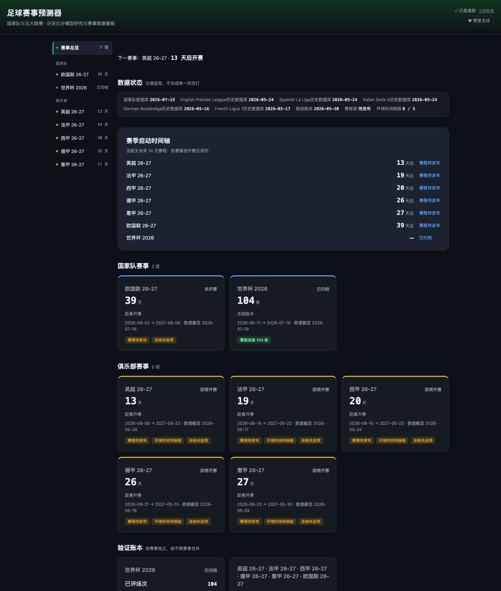
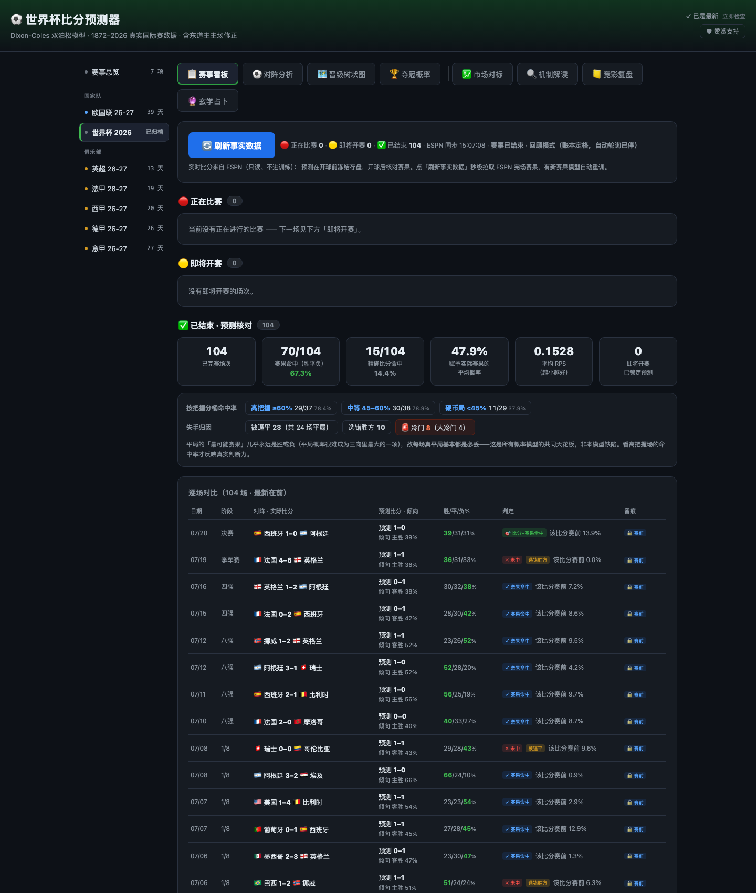

# ⚽ Top-tier Football Predictor

<p align="right"><strong>English</strong> · <a href="./README.zh-CN.md">简体中文</a> · <a href="./README.zh-TW.md">繁體中文</a></p>

### **[▶ Open the live demo](https://turingism.github.io/worldcup-predictor/)** — nothing to install, no API key

A Dixon-Coles double-Poisson engine fit on every international match from 1872–2026, plus per-league models for Europe's top five. Every number is falsifiable: any model change must beat the baseline in an out-of-sample backtest, or it doesn't ship.

> ## ⚠️ Disclaimer / 免责声明
> This is a **personal, educational open-source project** for statistical modeling, data analysis, and programming study only. It is **not** betting, investment, or any other advice. The author accepts **no liability** for anyone's use of it or for **any gambling/betting activity directly or indirectly associated with it**. All outputs are probabilistic estimates — **probability is not certainty**; gambling is negative-EV for most people over time and is legally restricted in many jurisdictions. You bear **all** risk and legal responsibility. Provided "as is" without warranty; using it means you have read and accepted this notice.
>
> *本项目为**个人学习与技术研究的开源作品**，仅用于统计建模、数据分析与编程学习，**不构成任何形式的投注、投资或决策建议**。作者不对任何人使用本项目、以及由此**直接或间接关联的任何赌球、博彩等行为及其后果**承担任何责任。概率不等于确定结果；博彩长期对绝大多数人 EV 为负且多地受法律限制。一切风险与法律责任由使用者自负。按"现状"提供，不附带任何担保。*

<p align="center">
  
</p>

---

## Two model universes, one engine

| | National teams | Clubs |
|---|---|---|
| Data | 1872–2026 internationals, 257 teams | football-data.co.uk, top-5 leagues |
| Half-life | 730 days | 365 days |
| Covers | World Cup 2026, Nations League — engine-wise any international fixture | EPL / La Liga / Serie A / Bundesliga / Ligue 1 |
| Tournament view | Monte-Carlo bracket with host advantage, title odds with a Bayesian interval band | Season simulator: title / top-4 / relegation odds |

Both half-lives were settled by backtest rather than taste, and they genuinely differ — don't copy one universe's hyper-parameters to the other.

**Per match:** score-probability matrix, W/D/L, over/under, BTTS, Asian-handicap fair line, a deep pre-match report (recent form, head-to-head, attack/defence ratings), and a plain-language read of what the numbers say.

**Keeping it honest:** predictions are frozen before kickoff into a verification ledger, then scored against reality — per match, bucketed by confidence, with miss attribution. A market/CLV layer benchmarks the model against bookmaker closing lines and reports plainly that **the model does not beat them**.

Full feature walkthrough with screenshots: **[`docs/FEATURES.md`](./docs/FEATURES.md)**.

---

## Accuracy

Out-of-sample over ~1,388 international matches, trained only on pre-cutoff data:

| Metric | Value | |
|---|---|---|
| **RPS** | **0.1624** | lower is better; bookmaker-closing-line territory |
| **Hit-rate** | **59.7%** | 3-way argmax, across *all* internationals |
| **Calibration (ECE)** | **1.06%** | against an 8–10% industry baseline |
| **Goal-diff correlation** | **65%** | Goldman's own metric |

Quote the stratified numbers, not the mixed one. **World-Cup-finals only** (2014/18/22/26 pooled, n=295) is RPS 0.186 / hit 61.0% CI[55.6, 66.8] — and on identical 2026 matches the bookmaker's closing line still beat the model (0.1462 vs 0.1514). That gap is reported rather than buried, and it is why this project has no betting-advice surface anywhere.

### The 2026 World Cup, settled in full

All **104 matches** are played and scored. Every prediction was **frozen before kickoff** — each row carries its `frozen_at` timestamp — then checked against the real result. 3 rows were backfilled with leakage-protected as-of models and are tagged `retro`. The ledger is committed to this repo, so the live demo shows the same pre-committed record rather than one rebuilt after the fact:

| | |
|---|---|
| **Result hit-rate** | **70 / 104 = 67.3%** |
| **Mean RPS** | **0.1528** |
| Exact scoreline | 15 / 104 = 14.4% |
| Mean probability assigned to what actually happened | 0.479 |

Both beat the long-run backtest baseline (59.7% / 0.1624) — a good tournament, not a better model; the engine has been frozen since the time-leak fix. The honest structure underneath: of **24 draws** the model called exactly **1**, and being held to a draw accounts for **23** of the 34 misses. On the high-confidence bucket (≥60%) it hit 78.4%. **argmax almost never outputs "draw"** — the shared ceiling of every probability model, not a defect of this one.

<p align="center">
  
</p>

Things that sound clever and were **rejected by backtest**, so you don't pay the sucker's tax: market-value priors · dynamic Elo (as replacement, ensemble, or shrinkage prior) · tournament-tier weighting · negative-binomial over-dispersion · isotonic/Platt post-calibration · draw-aware decision rules · neutral-venue tilt · ρ recency refit · per-confederation half-life.

> The remaining error is structural — the draw blind spot every probability model shares — plus small-sample noise. Not a fixable systematic bias. Numbers and method in **[`docs/backtest.md`](./docs/backtest.md)** and `CHANGELOG.md`.

---

## Run it yourself

```bash
git clone https://github.com/turingism/worldcup-predictor.git
cd worldcup-predictor
pip install -r requirements.txt

python3 app.py                                    # web app → http://127.0.0.1:8000
python3 predict.py "Argentina" "France" --cache   # one international fixture
python3 clubpredict.py "阿森纳" "曼城"              # one club fixture (league auto-detected)
python3 simulate.py --sims 5000                   # title odds
python3 backtest.py                               # prove any change is actually better
```

First run trains the model (~1 min) and caches it; instant afterwards. Team names work in English or Chinese. `READONLY=1 python3 app.py` serves a share mode with every write path disabled. Match-day operations: **[`docs/RUNBOOK.md`](./docs/RUNBOOK.md)**.

```python
import data
from model import DixonColesModel

m = DixonColesModel(half_life_days=730).fit(data.load_raw())
r = m.predict("Argentina", "France", neutral=True)
r["top_scores"][0]      # ((1, 0), 0.169)
r["p_home"], r["p_draw"], r["p_away"]
r["matrix"]             # full score-probability matrix
```

---

## How the live demo is built

The demo is a **frozen static snapshot** on GitHub Pages. There is no server.

That is a deliberate architecture, not a compromise. Measured on this app: a cold verification pass peaks near **3 GB** of RAM, `/api/market` alone adds **873 MB**, and warming the caches takes **262 s**. No free hosting runtime survives that. But under a frozen snapshot every read endpoint is a deterministic function of the data — so all of it moves into the build, where GitHub Actions gives public repos a free, unmetered 4-core / 16 GB runner. The workflow trains the model, warms every cache, pre-renders the whole API surface to JSON, and publishes. Runtime memory on the live site is zero; first paint is a CDN file read.

```bash
python3 warmup.py                      # train + warm caches
python3 export_static.py --out dist    # pre-render the API surface
```

The front-end is untouched apart from one shim: `apiFetch()` resolves a URL to its pre-rendered file through a deterministic FNV-1a hash of the canonicalized query — no index, no preload. In dynamic mode `STATIC_MODE` is `false` and `apiFetch` *is* `fetch`, so self-hosting behaves exactly as before. Frozen-vector tests pin that hash contract on both sides, because a silent drift there would 404 the entire site.

What a snapshot cannot do: live in-play updates and any write path (refresh, what-if scenarios, manual entry). All of those work when you self-host — and `READONLY=1` already disables them, so the two modes agree.

---

## Project layout

| | |
|---|---|
| `model.py` `data.py` `predict.py` | Dixon-Coles engine, data layer, single-match CLI |
| `simulate.py` `wc2026.py` `schedule.py` | Monte-Carlo tournament, official bracket, fixtures |
| `clubdata.py` `clubpredict.py` `clubsim.py` | club data layer, per-league models, season simulator |
| `verify.py` `clubverify.py` | pre-match freezing, post-match settlement |
| `clv.py` `market_research.py` `explainer.py` | market benchmarking, line-movement research, mechanism read |
| `home_dashboard.py` `manager.py` `narrative.py` | cross-event overview, deep report, plain-language layer |
| `bayes.py` `champ_ci.py` `inplay.py` | hierarchical ratings, title interval band, in-play W/D/L |
| `export_static.py` `warmup.py` | static snapshot build |
| `app.py` `templates/index.html` | Flask backend, single-page front-end |
| `test_core.py` | 212 regression tests |
| `docs/` | features, backtest, data sources, method notes, runbook |

Operations manual for AI coding agents: **[`skill/SKILL.md`](./skill/SKILL.md)**.

---

## Method provenance

Maher (1982) for Poisson goal modeling · Dixon & Coles (1997) for the low-score correlation correction and time weighting · Lee (1997) for the independent double-Poisson baseline · Shin (1992) de-vigging for reading market prices · Fjelstul World Cup DB for 90-minute score reconstruction · martj42's international results dataset · football-data.co.uk for club data and odds.

---

## ☕ Support (entirely optional)

Free and open source. If it made watching football a bit more fun, you're welcome to buy the author a coffee.

<p align="center">
  
</p>

> Tipping unlocks nothing and buys no prediction service. Every feature is, and stays, free for everyone. When self-hosting, replace `data/sponsor.png` with your own QR.
