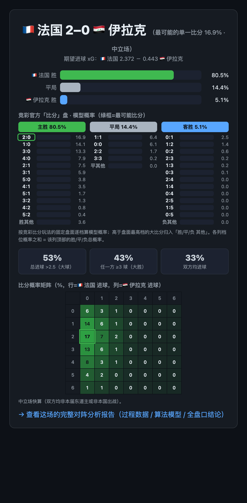
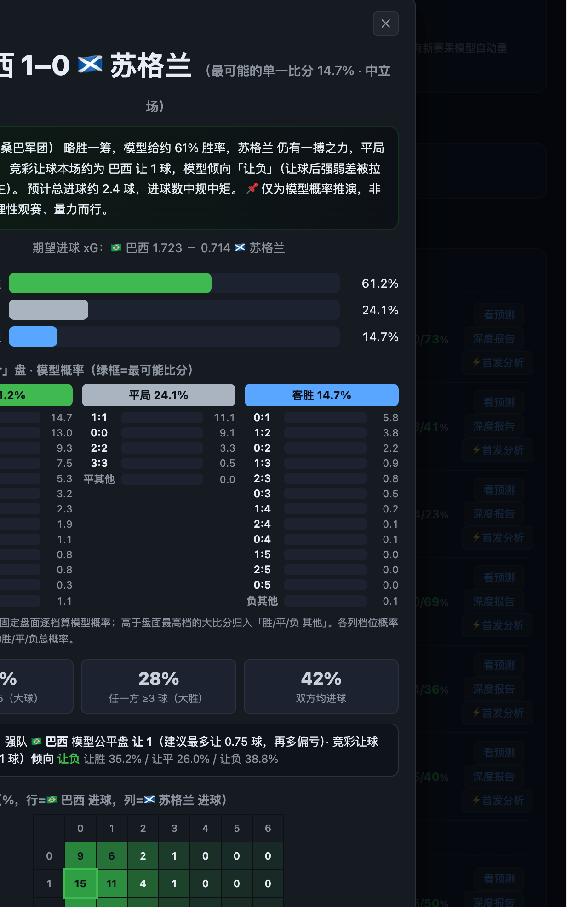
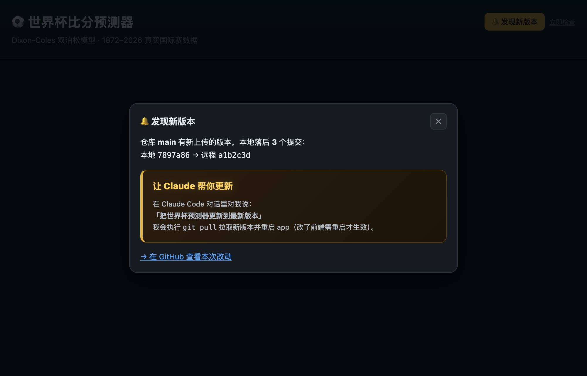
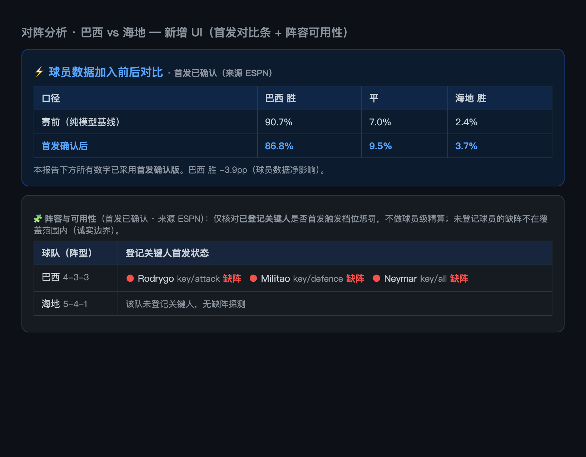
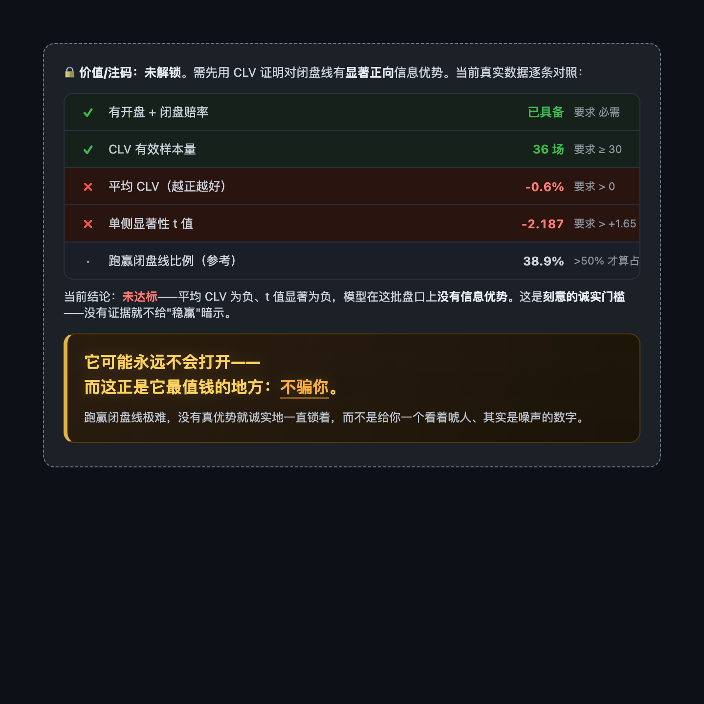

# ⚽ 世界杯比分预测器 · World Cup Score Predictor

<p align="right"><a href="./README.md">English</a> · <strong>简体中文</strong></p>

> ## ⚠️ 免责声明 / Disclaimer
> 本项目为**个人学习与技术研究的开源作品**，仅用于统计建模、数据分析与编程学习目的，**不构成任何形式的投注、投资或决策建议**。作者不对任何人使用本项目的行为、以及由此**直接或间接关联的任何赌球、博彩等行为及其后果**承担任何责任。所有输出均为统计概率估计——**概率不等于确定结果**；博彩长期对绝大多数人期望收益为负，且在许多法域受法律限制。是否参与、以及由此产生的一切风险与法律责任**完全由使用者自行承担**。本项目按"现状"（as-is）提供，不附带任何明示或默示担保；使用即视为已阅读并同意本声明。
>
> *This is a personal, educational open-source project for statistical modeling and programming study only. It is **not** betting, investment, or any other advice. The author accepts **no liability** for anyone's use of it or for **any gambling/betting activity directly or indirectly associated with it**. All outputs are probabilistic estimates — probability is not certainty; gambling is negative-EV for most people over time and is legally restricted in many jurisdictions. You bear all risk and legal responsibility. Provided "as is" without warranty.*

---

> **不是又一个"AI 凭感觉吹球"的玩具。** 这是一台用 1872–2026 全量真实国际比赛数据、Dixon‑Coles 双泊松统计引擎驱动、经样本外回测校准过的**可交互实时概率机器**——每一个数字都能被回测证伪，每一次刷新都跟着真实赛果走。

<p align="center">
  
  <br><sub><em>赛事看板（首屏）—— 正在比赛 / 即将开赛 / 已结束一屏掌握，按日分组、每场可一键看比分预测或直达深度报告；右上角自动检测仓库是否落后远程 main。</em></sub>
</p>

<p align="center">
  <code>Dixon-Coles 双泊松</code> · <code>蒙特卡洛模拟</code> · <code>2026 官方赛制括号</code> · <code>ESPN 分钟级实时</code> · <code>In-play 实时胜平负</code> · <code>贝叶斯可信区间</code> · <code>Flask 一键起网页</code>
</p>

---

## 🎯 一句话价值

**输入两支球队 → 给你最可能比分、完整比分概率矩阵、胜平负、期望进球(xG)。**
**点一下模拟 → 给你 48 强每一队的夺冠 / 进决赛 / 四强 / 出线概率，带 90% 可信区间。**
**开赛之后 → 真实赛果秒级同步、预测随事实自动重算；比赛进行中，胜平负概率随比分和剩余时间实时跳动。**
**事后 → 每场赛前预测开球前冻结存证，逐场核对命中率，谁也别想事后改口。**

别人给你一句"我觉得阿根廷夺冠"，我们给你 **一个带 90% 可信区间、能被回测证伪、随真实赛果自动更新的概率分布**——还告诉你这个数字是怎么算出来的、为什么可信、以及它有多不确定。

---

## 🆕 这一版新增（开赛期实战能力）

| 能力 | 一句话 |
|---|---|
| 📋 **赛事看板**（首屏） | 正在比赛 / 即将开赛 / 已结束 三态聚合，一屏掌握全局，每场可弹比分预测、或一键直达该场**深度报告** |
| 🎯 **正确比分概率盘** | 「看预测」弹窗升级为完整**正确比分概率盘**：按比分玩法固定盘面逐档给出模型概率，大比分(3-0 / 4-0…)带真实概率自然浮现、并**高亮最可能比分**——外加 总进球>2.5 / 任一方≥3 球 / 双方进球 概率 + 完整比分矩阵热力图。解决了"预测比分为什么总是小比分"的困惑（众数≠期望，是统计现象不是 bug） |
| ⚡ **In-play 实时胜平负** | 比赛进行中，用赛前 λ 按剩余时间缩放 + 当前比分卷积，给出"从现状到终场"的实时胜平负——**赛前一锤子 → 实时概率引擎** |
| ⚽ **对阵分析深度报告**（足球经理人） | 任选两队出资深分析师风格报告：过程数据（近期状态/历史交锋/攻防）→ 算法模型（Dixon-Coles 比分矩阵 + 热力图）→ 结论（1X2 / 大小球 / BTTS / 亚盘 / 正确比分 / 置信度）。原「单场预测」已并入此处 |
| ⚖️ **让球机制**（一整套） | 不放选择器**直接给让球结论**：全档(让0.5→3)扫描 + 模型**公平盘**(让球后≈五五开)高亮 + 每档"偏值/公平/偏亏"性价比；**竞彩让球线按本场动态确定**(让N/平手)——按模型期望净胜球定，不再写死「让1球」；综合**全队净胜球榜 / 小组实时排名 / 已晋级球队心态**（已出线→轮换预警，可选启发式降权）；接 **ESPN/DraftKings 真实让球盘**做模型公平盘 vs 市场线**背离 + 盘口移动**对标；一座**让球命中率擂台**用赛前冻结矩阵+真实赛果检验竞彩让球命中率(分桶)、公平盘校准、**模型 vs 市场谁更准**(MAE / 期望净胜 / 打赢闭线 / 让球 CLV)。诚实结论：**模型让球打不赢市场闭线**——用数字如实说。看板每场带「让X」速览、看预测弹窗带让球速览+市场对标 |
| 📣 **比赛解读** | 把模型胜率翻成一句**球迷语言**（球队昵称如桑巴军团/高卢雄鸡、大热/势均/爆冷叙事、进球氛围），并接**本场动态竞彩让球线**（让N/平手倾向）。**合规铁律**内置：违规词守卫（禁"稳赚/必中/包赢"等担保/诱导词，违反即抛）、每条必带「非投注建议、理性观赛」尾注、只陈述概率事实不导购。展示在「看预测」弹窗与「对阵分析」报告头（绿色置顶卡）；**纯只读、绝不碰预测引擎** |
| 🧩 **首发名单接入** | 对阵分析里：从 ESPN 拉**确认首发**（约赛前 1 小时公布），与登记关键人做布尔核对 → 触发可用性 xG 惩罚 → 展示**赛前(纯模型) vs 首发确认**的概率对比。含**明日对战看板**（点任意场次自动填表分析）+ 完赛**首发增益记分卡**（加入首发数据到底有没有让预测更准？对真实赛果打分，诚实小样本）。只读、opt-in，**绝不**碰引擎 / 回测 / 冻结账本 |
| 🎯 **预测验证层** | 赛前预测**开球前冻结**存证；逐场核对赛果/比分命中，按置信度分桶、标注冷门——拿数字逼自己诚实（位于看板「已结束」区） |
| 💹 **市场对标 / CLV** | 模型 vs 博彩闭盘线 + 闭盘线价值(CLV)**可证伪检验**；**没有显著正 CLV 就不显示任何"价值/注码"**——做诚实检验，不做下注诱导。门槛现已改为**逐条清单**：把真实 CLV 数字（样本量 / 平均 CLV / t 值 / 跑赢闭盘比例）与是否达标透明列出——"为什么价值面板锁着"完全有据可查 |
| 🔄 **仓库更新检测**（右上角） | 定时 `git fetch` + `rev-list` 比对本地落后远程 `main` 的提交数（**走 git 协议、不碰 GitHub API**，免限流），告诉你落后几个提交；15 分钟缓存、断网优雅降级。发现新版本时提示你**对 Claude 说一句话就能更新**（自动 `git pull` + 重启） |
| 📈 **夺冠 90% 可信区间 + 实力榜** | 贝叶斯分层后验驱动，给夺冠概率配可信区间（参数不确定性），**并**同屏展示其上游的净实力榜——同一套后验的上下游两视图，新赛果后**自动后台重算** |
| 🔮 **玄学占卜**（文化彩蛋） | 七套传统术数各按**干支真实起卦、确定性排盘**为每场"占"出比分——并用诚实擂台证明**没有一套能超过无脑基线**。是文化/算法趣味实验，**无科学或预测依据，非投注建议** |

---

## 🔥 为什么它不一样（核心卖点）

| 普通"预测" | 世界杯比分预测器 |
|---|---|
| 拍脑袋、抄热搜 | **学术级统计模型**：Maher(1982) → Dixon‑Coles(1997) 一脉相承 |
| 一个"谁赢"的结论 | **整张比分概率矩阵** + xG + 胜平负 + Top7 比分 |
| 无法验证对错 | **样本外回测**（RPS / LogLoss / 命中率）逼自己说真话 |
| 赛前算一次就完事 | **开赛期实时引擎**：ESPN 分钟级完场 → 自动重训 → 概率随赛况漂移 |
| 黑箱 | **全程可编辑、可解读**：改任意比分做假设，括号与夺冠率实时重算 |

> 我们甚至完整拆读了 Kimi 的 224 页、300+ agent 世界杯研报，做了两组对标回测——结论：**把它的核心方法论照搬过来会让我们更差**。我方单一可回测引擎在同口径上已是最优。详见 [对标章节](#-我们和-kimi-研报比过了)。

---

## 🧠 预测引擎：你买到的到底是什么算法

### 1. 真实数据，不是模拟数据
- 数据源 `martj42/international_results`：**1872–2026 全部国家队比分**。
- 世界杯是国家队赛事，**俱乐部联赛数据无效**——我们从根上选对了样本。

### 2. 双泊松 GLM + Dixon‑Coles 修正
- 每队进球服从 Poisson(λ)，用**进攻力 / 防守力 / 主场优势**建模 log λ，凸优化几秒收敛。
- Dixon‑Coles 相关参数 ρ 专门修正独立泊松对 **0‑0 / 1‑1 等低分平局**的低估——这是足球建模的学术标准动作。

### 3. 时间衰减加权（回测调出来的，不是猜的）
- 越近的比赛权重越高，**半衰期 730 天**为修复时间泄漏后的样本外回测最优值。
- 短期状态 > 历史声誉：模型信**近期真实场上证据**，不信光环——同一支队的近期战绩，比它的名气更能决定我们给的概率。

### 4. 中立场 / 东道主主场，分得清
- 世界杯多为中立场，主场优势**只给真正的主队**（如东道主美 / 墨 / 加在本国城市，+23% xG）。
- 模拟器精确到**城市→东道主国映射**，实测把东道主出线率拉到 美 51% / 墨 95% / 加 94%。

### 5. 蒙特卡洛整届模拟
- 自动从赛程构建 **2026 官方 12 组 + 官方括号 + 最佳第三名分配**。
- 抽小组赛比分 → 算排名 → 出线 32 队 → 单场淘汰（平局点球模拟）→ 统计每队各轮频率。
- **5000 次约 1–2 秒**，夺冠概率带模拟置信区间。

---

## 🖥️ 三种用法，从命令行到一键网页

### A. 命令行单场预测
```bash
python3 predict.py "Argentina" "France" --cache    # 支持中文队名，--cache 后秒开
```
```
  ⚽ Argentina  vs  France   (中立场)
  ──────────────────────────────────────────────
  期望进球 (xG):   Argentina 1.17  -  0.75 France

  赛果概率
    Argentina      胜   45.4%  ███████████·············
    平局               30.9%  ███████·················
    France         胜   23.7%  ██████··················

  最可能比分 (Top 7)
    1-0    16.9%   1-1 13.0% ...

  ➜ 最可能比分: Argentina 1-0 France  (16.9%)
```

### B. 命令行夺冠概率
```bash
python3 simulate.py --sims 5000      # 模拟整届，输出夺冠/进决赛/四强/八强/出线概率
```

### C. 一键起网页（核心体验）
```bash
python3 app.py        # 打开 http://127.0.0.1:8000
```

**网页六大 Tab——统一图标、并按「核心 / 对照」两组划分——把整个"预测期"做成了一个能玩的实时产品：**

#### 📋 赛事看板（首屏 / 产品入口）
- **三态聚合**：🔴 正在比赛（ESPN 实时比分 + 分钟 + **实时胜平负条**）/ 🟡 即将开赛（按比赛日分组，带模型预测比分 + 三向概率）/ ✅ 已结束（逐场核对预测 vs 实际、按把握分桶、标注冷门——**预测验证账本**就在这里）。
- 每场一键「**看预测**」→ 弹出**正确比分概率盘**（详见下节），**与该行概率同口径**（含东道主主场修正）；每场还带「**深度报告**」直达对阵分析。
- 开着就自己跑：统一调度器只在该 tab 可见时拉实时比分与完赛（有新完赛即自动重训模型 + 重算夺冠区间）、博彩盘口每 30 分钟快照——全程零点击。「**🔄 刷新事实数据**」用于立即手动拉一次。调度本身也做了加固：实时刷新加**原子节流锁**、后台任务统一节流口径、重训锁收窄、断网恢复后**自动补拉**漏掉的数据。整个 UI **响应式下探到 ≤430px 移动端断点**（不溢出），配色全面 **token 化**（平局色独立、热力图高概率格对比度更高）。
- **同源同口径**：看板「即将开赛」与对阵分析的待赛清单此前一度对同一天比赛数对不上（对阵分析漏场）。根因是待赛过滤误用了"全历史交手过的队对"——把历史踢过友谊赛的未来对阵（如英格兰 vs 加纳）删掉了，少了 15 场。现已改为**只按本届世界杯已赛过滤**，两视图同源同口径，并加了回归测试守住。

#### 🎯 正确比分概率盘（看板「看预测」弹窗）
点任意一场的「看预测」→ 弹出一张**正确比分概率盘**：按比分玩法的固定盘面逐档给出模型概率，**大比分（3-0 / 4-0…）也带着真实概率自然浮现**，并**高亮最可能比分**。盘面下方附 **总进球 > 2.5 / 任一方 ≥ 3 球 / 双方进球** 概率，以及**完整比分矩阵热力图**。
这解决了一个常见困惑——"预测比分为什么永远只显示小比分？"其实那是**众数 ≠ 期望**的统计现象（最可能的单一比分往往是 1-0，但概率分布很宽），不是 bug。弹窗底部还带「**→ 完整对阵分析**」链接，一键跳到该对阵的深度报告。
<p align="center">
  
  <br><sub><em>正确比分概率盘——固定盘面逐档概率 + 高亮最可能比分 + 大小球 / 任一方≥3 / 双方进球 + 比分矩阵热力图。</em></sub>
</p>

#### 📣 比赛解读（把概率翻成球迷语言）
在「看预测」弹窗与「对阵分析」报告头各置顶一张**绿色解读卡**，把模型干巴巴的胜率翻成一句**球迷语言**：球队昵称（桑巴军团 / 高卢雄鸡…）、大热 / 占优 / 势均 / 爆冷的叙事、**本场动态竞彩让球线**（让N 或平手倾向），以及进球大战 / 闷战的氛围预判。它**纯只读、绝不碰预测引擎**——只是把模型已经算出的数字换成人话。**合规由设计保证**：内置违规词守卫，禁"稳赚 / 必中 / 包赢"等担保或诱导下注词（生成器本就不产出，再加一道运行时守卫，违反即抛）；每条文案必带「📌 仅为模型概率推演，非投注建议，理性观赛、量力而行」尾注；只陈述概率与事实，**不导购彩票、不给出票/买入建议**。
<p align="center">
  
  <br><sub><em>比赛解读卡——把模型概率翻成球迷语言，附本场动态让球倾向，并内置「非投注建议、理性观赛」声明。</em></sub>
</p>

#### 🔄 仓库更新检测（右上角）
页面右上角会定时跑 `git fetch` + `rev-list`，**比对本地落后远程 `main` 的提交数**——全程**走 git 协议、不碰 GitHub API**（避免匿名限流），15 分钟缓存、断网时优雅降级（静默，不报错刷屏）。一旦发现有新版本，就提示你：**对 Claude 说一句话即可更新**（自动 `git pull` + 重启），不用记命令、不用切终端。
<p align="center">
  
  <br><sub><em>仓库更新检测——右上角显示本地落后远程的提交数，发现新版本时提示"对 Claude 一句话更新"。</em></sub>
</p>

#### ⚡ In-play 实时胜平负（差异化护城河）
比赛进行中，看板的 LIVE 卡片显示一条实时胜平负堆叠条：赛前 Dixon‑Coles 的期望进球 λ 按**剩余时间缩放**，叠加**当前比分**做泊松卷积，得"从现状到终场"的主胜/平/客胜——随每一个进球和分钟跳动。**只读引擎、严格隔离，绝不污染赛前预测的可证伪性。**

#### ⚽ 对阵分析（足球经理人深度报告）
两队下拉 + 中立场开关 → 一份**资深分析师风格报告**，三段式：**过程数据**（近期状态 / 历史交锋 / 攻防均值，源自真实历史）→ **算法模型**（Dixon-Coles 双泊松，含**完整比分概率矩阵热力图**——原「单场预测」已并入此处）→ **结论**（1X2 / 大小球 1.5·2.5·3.5 / BTTS / 总进球 / 正确比分 / 亚盘让球 / 竞彩让球 / 半全场 + 胜负倾向与置信度）。其中**竞彩让球线现按本场动态确定**——N = round(模型期望净胜球)、clamp[0,6]，不再写死「让1球」：强弱悬殊→让2/让3（如摩洛哥打海地期望净胜 1.98→让2），势均力敌→平手(让0，等同常规胜平负，如德国vs厄瓜多尔)，再按该线判让胜(净胜>N)/让平(净胜=N)/让负(净胜<N)。定性维度（阵型/首发/天气）如实标注"引擎不提供"，半全场标低置信。支持**深链直达指定对阵**（`#manager?h=&a=`），看板每场的「深度报告」、看预测弹窗的「→ 完整对阵分析」都直接跳到这里。
<p align="center"></p>

**🧩 首发名单接入**（opt-in「⚡ 拉首发重算」）：阵型/首发原本标注"引擎不提供"——现在赛前约 1 小时从 ESPN 拉**确认首发**，与登记关键人做布尔核对，展示**赛前(纯模型) vs 首发确认**的概率对比（例：某强队 3 名关键球员确认缺阵，取胜 90.7% → 86.8%）。**明日对战看板**可点任意场次自动填表分析，完赛后**首发增益记分卡**用真实赛果检验"加入首发数据有没有让预测更准"（诚实、小样本）。全程只读 & opt-in，**绝不**碰引擎 / 回测 / 冻结账本。
<p align="center"></p>

#### 🌳 本届实时晋级树
- **2026 官方赛制**：12 组 + 官方括号 + 最佳第三名分配，投影最可能的官方括号与冠军。
- 真实赛果蓝色锁定，其余按模型预测；**全程可编辑**：改任意比分 / 录入或假设淘汰赛结果（平局可设点球胜者）→ 括号 + 夺冠概率实时重算；录入自动存盘、刷新不丢。
- 每场标注日期 + 北京/当地时间切换 + 状态。与夺冠概率 tab 交叉链接（一条最可能**路径** vs 完整概率**分布**）。
<p align="center"></p>

#### 🏆 夺冠概率 + 实力榜
- 一键蒙特卡洛点估 + 晋级漏斗（出线→八强→四强→决赛→夺冠），条件化在你录入/假设的赛果上。
- **贝叶斯分层后验驱动的 90% 可信区间**（whisker 图）：区间宽且重叠＝夺冠次序本就高度不确定。新赛果后**后台自动重算**。
- **实力榜**（贝叶斯净实力 + 94% 可信区间）同屏置于其下，作为夺冠区间的**上游**——同一套后验，一个看球队实力、一个看它经括号传播后的夺冠%。情境因素（模型 vs 名气解读、关键球员伤停、海拔/高温）折叠在下方。
<p align="center"></p>

#### 💹 市场对标 / CLV
- 模型 vs 博彩闭盘线 + CLV 可证伪检验；**理性博彩护栏 + 严格门槛**——无显著正 CLV 不显示任何价值/Kelly 注码。
  - *赔率从哪来*：复用我们抓比分的同一个 **ESPN 公开 API**，其 `pickcenter` 带 **DraftKings 的 1X2 美式赔率**——**不抓博彩/赔率门户站**（其 ToS 禁止）。app 运行期间每 ~30 分钟（及每次刷新）快照一次盘口，于是每场比赛逐步积累**开盘**（首次快照）与**闭盘**（开球前最后一次）线——正是 CLV 所需。
  - *CLV 怎么积累*：一场比赛只有**已完赛**且我们跨时段抓到过它的盘口，才进入 CLV 统计。所以开赛初期会诚实显示"样本不足"，随比赛推进逐步填充。价值/Kelly 面板**仅当**模型呈现统计显著的正 CLV（≥30 场、t>1.65）才解锁，否则保持锁定。「看演示」按钮用**明确标注的合成数据**展示解锁后的样子。
  - *门槛改为逐条清单*：不再只甩一句"锁定/解锁"，而是把真实 CLV 数字**逐条**列给你——**样本量 / 平均 CLV / t 值 / 跑赢闭盘比例**，每一条都标注是否达标（如 ≥30 场、t>1.65）。"为什么价值面板锁着"从此完全有据可查，这是反"稳赢"暗示的诚实层。
  - *它可能永远不会打开——而这正是它最值钱的地方：不骗你。* 跑赢闭盘线极难，若模型没有真优势，它会诚实地一直锁着，而不是给你一个看着唬人、其实是噪声的数字。
<p align="center">
  
  <br><sub><em>CLV 诚实门槛逐条清单——真实数字透明展示，每条标注是否达标，价值面板锁着的原因一目了然。</em></sub>
</p>

#### 🔮 玄学占卜（文化彩蛋——明确**不是预测**）
一个趣味的**确定性**图层，把每场比赛交给**七套中国传统术数**各占一卦：**梅花易数 / 射覆 / 周易·六十四卦 / 六爻纳甲 / 奇门遁甲 / 大六壬 / 紫微斗数**。每一套都按**开球时刻的干支时间柱真实排盘**驱动（年/日/时柱精确、月建按真太阳黄经定节气、给定球场经度时还会先校**真太阳时**）：奇门真有阴阳遁/三元定局/三奇六仪/九星八门八神，六爻真有京房八宫定世应/纳甲六亲，大六壬真有月将加占时排天地盘/四课/九宗门发三传，紫微真有安星/庙旺利陷/生年四化……队名只进一层很薄的**取用层**（分主客、区分同一时刻的不同对阵），**绝不灌入真实球队实力**。

> **这是文化/算法趣味实验，无任何科学或预测依据——切勿用于投注或任何现实决策。** 而且这个 tab 对此很诚实：内置一座**擂台把七法和无脑基线**（永远押主胜 / 全押最常见比分 / 随机）放在一起比，既比本届赛前冻结的占卜、**也比一份 4.9 万+场的历史回测**——结果是**没有一套术数能超过基线**（七法全部贴近随机 ~1/3，远低于 ~49% 的"永远押主胜"线）。**排盘越正统、却照样赢不了基线——这正是它要说的话。**

<p align="center"></p>

---

## 📊 我们用数字逼自己说真话（回测）

### 📈 准确率一览（样本外 · ~1388 场国际赛）

| 指标 | 数值 | 含义 |
|---|---|---|
| **RPS** | **0.1624** | 排序概率得分，越小越好——博彩闭盘线量级 |
| **胜平负命中率** | **59.7%** | 三向 argmax 准确率 |
| **校准 ECE** | **1.06%** | 行业基准 8–10%，**我们天生更校准** |
| **净胜球相关** | **65%** | 高盛同口径指标（其仅世界杯正赛自评 ~45–49%；样本群不同，仅作量级参照） |

*只用 cutoff 之前数据训练、预测之后的真实比赛（无泄漏）。`python3 backtest.py` 可复现。本届逐场核对（赛前预测开球前冻结、事后打分）在「预测验证」tab——开赛初期小样本（如 8 场里 3 场平局）会让命中率剧烈波动，所以上面的长期 ~60% 才是诚实基线。*

### 🎯 本届实测验证：命中率正在趋近真值

经过 **36 场已完赛**，实测胜平负命中率为 **55.6%**——这个数字背后是一个诚实的故事。开赛初期只有 8 场（其中 3 场平局）时，它只有 **37.5%**；而样本外回测的真实水平约为 **59.5%**（在 2420 场上复现）。关键在于：8 场样本与 36 场样本的 95% 置信区间**都覆盖 59.5%**——在统计意义上它们是**同一个数**。**命中率上升不是模型变强，而是样本变多后的均值回归。** 引擎自修复时间泄漏后就再没动过，所以这次趋近恰恰证明了它稳定、有效——不是运气，也没有偷偷改动。

<p align="center">
  
  <br><sub><em>预测验证记分卡（看板「已结束」区）——逐场核对赛果 / 比分命中，按把握分桶，并诚实标注失手归因。</em></sub>
</p>

- 在 **25 场决胜场**上模型命中 **80%**；全部 **11 场平局**（占样本 30.6%）是结构性丢失——取概率最大项时几乎不会选「平局」，这是**所有概率模型**的共同天花板，并非缺陷。
- **校准依旧成立**：用蒙特卡洛零分布可证，一个**完美校准**的模型在 n=36 下，ECE 均值本就有 **6.02%**；而我们实测只有 **4.47%**，反而**更低**（p=0.72）。本届概率是诚实校准的。

改任何模型 / 参数，**必须跑 `python3 backtest.py` 用 RPS / LogLoss / 命中率证明更好，否则不采用**。这是项目铁律。

```bash
python3 backtest.py     # 只用 cutoff 之前数据训练，预测之后真实比赛
```

样本外校准成绩（修复时间泄漏后诚实口径）：
- **训练集 ECE = 1.06%**（Kimi 自述行业基准 8–10%、<5% 算良好）——我们**天生就比行业基准更校准**。
- 可靠性对角线近乎完美：预测 .95 → 实际 .944。

被回测**否决**、因此默认关闭的"看起来很美"的改动（避免你交智商税）：

| 试过的"高级"改动 | 回测结论 |
|---|---|
| 身价 / 转会市值先验 | 对概率准度无改善 → 关闭（数值仍在 UI 展示） |
| 动态 Elo 评级（替代 / 集成 / 收缩先验） | 被 Dixon‑Coles 进球级信息支配 → 不整合 |
| 赛事强度分级加权 | 砍有效样本、升方差 → 全部更差 |
| 负二项过离散 | GLM 扣实力后残差近 Poisson → 单调更差 |
| Isotonic / Platt 后校准 | 我方已足够校准 → 后校准只会过拟合 |

> **这恰恰是卖点**：不是功能少，是我们替你试过了所有花哨方案，留下来的每一项都有回测背书。

#### 2026-06 优化 sprint —— 5 个杠杆，全部被回测否决

本届打满 36 场后，我们做了一次多 agent 优化 sprint，想再从引擎里榨出一点。每个杠杆都用**防泄漏的 fresh 模型、训练 / 留出拆分、对抗验证**严格检验；采纳门槛=池化 RPS 改善 > 0.0008 且在最近 cutoff 上不变差。结果五个全部诚实否决：

| 试过的杠杆 | 回测结论 |
|---|---|
| 平局决策规则 | argmax 已是命中率最优；表面增益在轮换留出集上无法泛化 |
| 中立场名义主场倾斜 | 发现了**真实**偏差（主队槽位被低估 +2.24pp），但只换来 +0.0002 RPS——只有门槛的 1/4，且是窄峰 |
| Dixon‑Coles ρ 近期性重拟 | +0.000008 RPS——惰性杠杆，低分结构跨时代稳定 |
| 分洲差异化半衰期 | 噪声（−0.00001 RPS）；在平底盆地上加自由度只会抬方差 |
| 本届重新校准 | 本就已校准（见上）——重校准只会过拟合，与已否决的 isotonic 同理 |

> 一个都没采纳，而这正是正确结果。**命中率与 RPS 已贴近双泊松模型在本数据上的信息上限**——剩余误差是结构性的（平局盲区）加小样本噪声，而非可修复的系统偏差。完整数字见 `CHANGELOG.md`。

---

## 🆚 我们和 Kimi 研报比过了

完整读完 Kimi 224 页 / 300+ agent / 20 维度的 2026 世界杯报告后，做了两组对标回测，结论清晰：

- **Kimi 强在广度与叙事**（地缘 / 伤病 / 天气 / 海拔 / 战术相克 / 黑天鹅），**弱在可证伪性**（多为定性，冠军概率上限自承 ≤25%）。
- **我方强在单一可回测引擎 + 真实场上证据 + 校准**。把 Kimi 的 Elo 收缩先验、后校准照搬过来，**回测全部单调恶化**。
- 两者非同类：**Kimi 像研报，我方像可交互的实时概率引擎。**

> 修复早期一处时间泄漏后，我方夺冠榜（阿根廷 / 西班牙 / 英格兰领跑）已与市场共识同量级；曾经"挪威排很前、法国偏后"的分歧主要是泄漏伪影。诚实记账、发现就改——详见 `CHANGELOG.md`。

---

## 🚀 快速开始

> 📓 比赛日运行看一页纸 **[比赛日运行手册](./docs/RUNBOOK.zh-CN.md)**。

```bash
# 1) 依赖（anaconda 通常已自带 numpy/pandas/scipy/statsmodels/flask）
pip install -r requirements.txt

# 2) 数据已自带 data/results.csv；要更新再跑
python3 download_data.py

# 3) 预测（首次训练约 1 分钟，--cache 后秒开）
python3 predict.py "Argentina" "France" --cache

# 4) 起网页
python3 app.py        # http://127.0.0.1:8000
```

### 在你自己的代码里调用
```python
import data
from model import DixonColesModel

m = DixonColesModel(half_life_days=730).fit(data.load_raw())
r = m.predict("Argentina", "France", neutral=True)
print(r["top_scores"][0])   # ((1, 0), 0.169)
print(r["p_home"], r["p_draw"], r["p_away"])
print(r["matrix"])          # 11x11 完整比分概率矩阵
```

---

## 📁 工程一览

```
worldcup-predictor/
├── data.py        数据层：清洗 + 时间/赛事加权 + 长表 + 实时赛果合并
├── model.py       DixonColesModel：GLM + ρ 修正 + 比分矩阵
├── predict.py     CLI：单场 / 实力榜 / 赛程批量
├── simulate.py    蒙特卡洛：整届模拟 → 夺冠概率（含东道主主场）
├── wc2026.py      2026 官方赛制：分组 + 官方括号 + 第三名分配
├── schedule.py    全 104 场开球时间 + 场馆/当地时间换算
├── live.py        ESPN 实时层：完场抓取 + 进行中状态（分钟级、含点球）
├── ganzhi.py      干支 / 节气时间柱推算（由开球时刻定年/日/时柱 + 真太阳时）
├── xuanxue.py     🔮 玄学占卜引擎：7 套传统术数，确定性忠实排盘
├── xuanxue_board.py  🔮 玄学擂台：赛前冻结账本 + 诚实基线 + 历史回测
├── inplay.py      ⚡ In-play 实时胜平负（赛前 λ 缩放 + 当前比分卷积）
├── manager.py     ⚽ 对阵分析报告（只读组装：过程数据 + DC 比分矩阵 + 衍生盘口 + 让球结论/动机/市场对标）
├── standings.py   ⚖️ 上下文表（只读）：全队净胜球榜 + 小组实时排名 + 已出线检测（动机层输入）
├── handicap_ledger.py ⚖️ 让球命中率擂台：赛前冻结矩阵结算竞彩命中率/公平盘校准/模型 vs 市场/让球 CLV
├── narrative.py   📣 比赛解读文案层（球迷语言 + 违规词守卫，纯展示）
├── verify.py      🎯 预测验证：赛前冻结存证 + 逐场核对 + 分桶/冷门
├── clv.py         💹 市场对标 / CLV 诚实检验 + EV/分数 Kelly（门槛 gating）
├── bayes.py       PyMC 分层贝叶斯评级（补充视图）+ 导出后验抽样
├── champ_ci.py    📈 夺冠概率 90% 可信区间（bayes 后验驱动 MC）
├── backtest.py    样本外回测（RPS / LogLoss / 命中率）；bt_*.py 各类对比回测
├── app.py         Flask 后端（看板/预测/模拟/验证/市场/区间 + 后台自动重算 + 更新检测）
├── test_core.py   回归测试（33 项：预测合理性 / 矩阵归一 / API 冒烟 / 待赛清单一致性 / …）
└── templates/index.html   单页 UI（看板 + 正确比分概率盘 + 热力图 + 晋级树 + 夺冠榜 + 区间 + 市场 + 更新检测）
```

---

## 📚 方法出处（站在巨人肩上）
- **Maher (1982)** — 泊松建模足球进球
- **Dixon & Coles (1997)** — 低分相关修正 + 时间加权
- **Lee (1997)** — 双泊松独立模型

---

<p align="center">
  <strong>⚽ 看球之前，先看概率。</strong><br>
  <em>真实数据驱动 · 样本外校准 · 实时随赛况更新 —— 一台你能亲手拨动的世界杯概率机器。</em>
</p>
