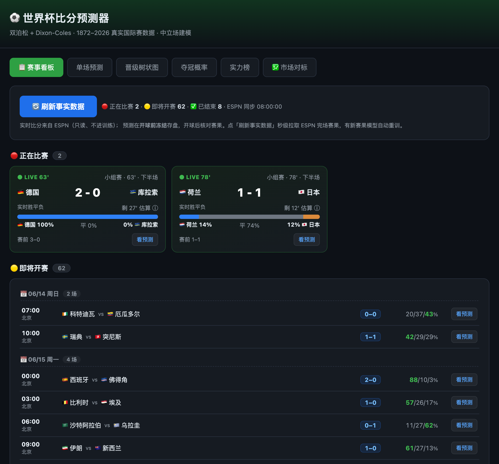

# ⚽ 世界杯比分预测器 · World Cup Score Predictor

<p align="right"><a href="./README.md">English</a> · <strong>简体中文</strong></p>

> ## ⚠️ 免责声明 / Disclaimer
> 本项目为**个人学习与技术研究的开源作品**，仅用于统计建模、数据分析与编程学习目的，**不构成任何形式的投注、投资或决策建议**。作者不对任何人使用本项目的行为、以及由此**直接或间接关联的任何赌球、博彩等行为及其后果**承担任何责任。所有输出均为统计概率估计——**概率不等于确定结果**；博彩长期对绝大多数人期望收益为负，且在许多法域受法律限制。是否参与、以及由此产生的一切风险与法律责任**完全由使用者自行承担**。本项目按"现状"（as-is）提供，不附带任何明示或默示担保；使用即视为已阅读并同意本声明。
>
> *This is a personal, educational open-source project for statistical modeling and programming study only. It is **not** betting, investment, or any other advice. The author accepts **no liability** for anyone's use of it or for **any gambling/betting activity directly or indirectly associated with it**. All outputs are probabilistic estimates — probability is not certainty; gambling is negative-EV for most people over time and is legally restricted in many jurisdictions. You bear all risk and legal responsibility. Provided "as is" without warranty.*

---

> **不是又一个"AI 凭感觉吹球"的玩具。** 这是一台用 1872–2026 全量真实国际比赛数据、Dixon‑Coles 双泊松统计引擎驱动、经样本外回测校准过的**可交互实时概率机器**——每一个数字都能被回测证伪，每一次刷新都跟着真实赛果走。

<p align="center">
  
  <br><sub><em>赛事看板 —— 实时胜平负条 + 按日分组的即将开赛预测。（图中实时比分为示意。）</em></sub>
</p>

<p align="center">
  <code>Dixon-Coles 双泊松</code> · <code>蒙特卡洛模拟</code> · <code>2026 官方赛制括号</code> · <code>ESPN 分钟级实时</code> · <code>In-play 实时胜平负</code> · <code>贝叶斯可信区间</code> · <code>Flask 一键起网页</code>
</p>

---

## 🎯 一句话价值

**输入两支球队 → 给你最可能比分、完整比分概率矩阵、胜平负、期望进球(xG)。**
**点一下模拟 → 给你 48 强每一队的夺冠 / 进决赛 / 四强 / 出线概率，带 90% 可信区间。**
**开赛之后 → 真实赛果秒级同步、预测随事实自动重算；比赛进行中，胜平负概率随比分和剩余时间实时跳动。**
**事后 → 每场赛前预测开球前冻结存证，逐场核对命中率，谁也别想事后改口。**

别人给你一句"我觉得阿根廷夺冠"，我们给你 **一个带 90% 可信区间、能被回测证伪、随真实赛果自动更新的概率分布**——还告诉你这个数字是怎么算出来的、为什么可信、以及它有多不确定。

---

## 🆕 这一版新增（开赛期实战能力）

| 能力 | 一句话 |
|---|---|
| 📋 **赛事看板**（首屏） | 正在比赛 / 即将开赛 / 已结束 三态聚合，一屏掌握全局，每场可弹比分预测 |
| ⚡ **In-play 实时胜平负** | 比赛进行中，用赛前 λ 按剩余时间缩放 + 当前比分卷积，给出"从现状到终场"的实时胜平负——**赛前一锤子 → 实时概率引擎** |
| 🎯 **预测验证层** | 赛前预测**开球前冻结**存证；逐场核对赛果/比分命中，按置信度分桶、标注冷门——拿数字逼自己诚实 |
| 💹 **市场对标 / CLV** | 模型 vs 博彩闭盘线 + 闭盘线价值(CLV)**可证伪检验**；**没有显著正 CLV 就不显示任何"价值/注码"**——做诚实检验，不做下注诱导 |
| 📈 **夺冠 90% 可信区间** | 贝叶斯分层后验驱动，给夺冠概率配可信区间（参数不确定性），新赛果后**自动后台重算** |

---

## 🔥 为什么它不一样（核心卖点）

| 普通"预测" | 世界杯比分预测器 |
|---|---|
| 拍脑袋、抄热搜 | **学术级统计模型**：Maher(1982) → Dixon‑Coles(1997) 一脉相承 |
| 一个"谁赢"的结论 | **整张比分概率矩阵** + xG + 胜平负 + Top7 比分 |
| 无法验证对错 | **样本外回测**（RPS / LogLoss / 命中率）逼自己说真话 |
| 赛前算一次就完事 | **开赛期实时引擎**：ESPN 分钟级完场 → 自动重训 → 概率随赛况漂移 |
| 黑箱 | **全程可编辑、可解读**：改任意比分做假设，括号与夺冠率实时重算 |

> 我们甚至完整拆读了 Kimi 的 224 页、300+ agent 世界杯研报，做了两组对标回测——结论：**把它的核心方法论照搬过来会让我们更差**。我方单一可回测引擎在同口径上已是最优。详见 [对标章节](#-我们和-kimi-研报比过了)。

---

## 🧠 预测引擎：你买到的到底是什么算法

### 1. 真实数据，不是模拟数据
- 数据源 `martj42/international_results`：**1872–2026 全部国家队比分**。
- 世界杯是国家队赛事，**俱乐部联赛数据无效**——我们从根上选对了样本。

### 2. 双泊松 GLM + Dixon‑Coles 修正
- 每队进球服从 Poisson(λ)，用**进攻力 / 防守力 / 主场优势**建模 log λ，凸优化几秒收敛。
- Dixon‑Coles 相关参数 ρ 专门修正独立泊松对 **0‑0 / 1‑1 等低分平局**的低估——这是足球建模的学术标准动作。

### 3. 时间衰减加权（回测调出来的，不是猜的）
- 越近的比赛权重越高，**半衰期 730 天**为修复时间泄漏后的样本外回测最优值。
- 短期状态 > 历史声誉：模型信**近期真实场上证据**，不信光环——同一支队的近期战绩，比它的名气更能决定我们给的概率。

### 4. 中立场 / 东道主主场，分得清
- 世界杯多为中立场，主场优势**只给真正的主队**（如东道主美 / 墨 / 加在本国城市，+23% xG）。
- 模拟器精确到**城市→东道主国映射**，实测把东道主出线率拉到 美 51% / 墨 95% / 加 94%。

### 5. 蒙特卡洛整届模拟
- 自动从赛程构建 **2026 官方 12 组 + 官方括号 + 最佳第三名分配**。
- 抽小组赛比分 → 算排名 → 出线 32 队 → 单场淘汰（平局点球模拟）→ 统计每队各轮频率。
- **5000 次约 1–2 秒**，夺冠概率带模拟置信区间。

---

## 🖥️ 三种用法，从命令行到一键网页

### A. 命令行单场预测
```bash
python3 predict.py "Argentina" "France" --cache    # 支持中文队名，--cache 后秒开
```
```
  ⚽ Argentina  vs  France   (中立场)
  ──────────────────────────────────────────────
  期望进球 (xG):   Argentina 1.17  -  0.75 France

  赛果概率
    Argentina      胜   45.4%  ███████████·············
    平局               30.9%  ███████·················
    France         胜   23.7%  ██████··················

  最可能比分 (Top 7)
    1-0    16.9%   1-1 13.0% ...

  ➜ 最可能比分: Argentina 1-0 France  (16.9%)
```

### B. 命令行夺冠概率
```bash
python3 simulate.py --sims 5000      # 模拟整届，输出夺冠/进决赛/四强/八强/出线概率
```

### C. 一键起网页（核心体验）
```bash
python3 app.py        # 打开 http://127.0.0.1:8000
```

**网页六大 Tab，把整个"预测期"做成了一个能玩的实时产品：**

#### 📋 赛事看板（首屏 / 产品入口）
- **三态聚合**：🔴 正在比赛（ESPN 实时比分 + 分钟 + **实时胜平负条**）/ 🟡 即将开赛（按比赛日分组，带模型预测比分 + 三向概率）/ ✅ 已结束（逐场核对命中）。
- 每场一键「**看预测**」→ 弹出完整比分概率矩阵。
- 「**🔄 刷新事实数据**」秒级拉 ESPN 完场赛果，有新赛果模型自动重训；看板每 60s 自动刷新实时比分。

#### ⚡ In-play 实时胜平负（差异化护城河）
比赛进行中，看板的 LIVE 卡片显示一条实时胜平负堆叠条：赛前 Dixon‑Coles 的期望进球 λ 按**剩余时间缩放**，叠加**当前比分**做泊松卷积，得"从现状到终场"的主胜/平/客胜——随每一个进球和分钟跳动。**只读引擎、严格隔离，绝不污染赛前预测的可证伪性。**

#### 🔮 单场预测
两队下拉 + 中立场开关 → **比分热力图 / 胜平负 / xG / Top7 比分**，一屏看全。

#### 🌳 本届实时晋级树
- **2026 官方赛制**：12 组 + 官方括号 + 最佳第三名分配，投影最可能的官方括号与冠军。
- 真实赛果蓝色锁定，其余按模型预测；**全程可编辑**：改任意比分 / 录入或假设淘汰赛结果（平局可设点球胜者）→ 括号 + 夺冠概率实时重算；录入自动存盘、刷新不丢。
- 每场标注日期 + 北京/当地时间切换 + 状态。

#### 🏆 夺冠概率（点估 + 90% 可信区间）
- 一键蒙特卡洛点估 + 晋级漏斗（出线→八强→四强→决赛→夺冠），条件化在你录入/假设的赛果上。
- **贝叶斯分层后验驱动的 90% 可信区间**（whisker 图）：区间宽且重叠＝夺冠次序本就高度不确定。新赛果后**后台自动重算**。

#### 🎯 预测验证 & 💹 市场对标
- **预测验证**：赛前预测开球前冻结存证，逐场核对赛果/比分命中、按把握分桶、标注冷门——账本不可事后篡改。
- **市场对标**：模型 vs 博彩闭盘线 + CLV 可证伪检验；**理性博彩护栏 + 严格门槛**——无显著正 CLV 不显示任何价值/Kelly 注码。
  - *赔率从哪来*：复用我们抓比分的同一个 **ESPN 公开 API**，其 `pickcenter` 带 **DraftKings 的 1X2 美式赔率**——**不抓博彩/赔率门户站**（其 ToS 禁止）。app 运行期间每 ~30 分钟（及每次刷新）快照一次盘口，于是每场比赛逐步积累**开盘**（首次快照）与**闭盘**（开球前最后一次）线——正是 CLV 所需。
  - *CLV 怎么积累*：一场比赛只有**已完赛**且我们跨时段抓到过它的盘口，才进入 CLV 统计。所以开赛初期会诚实显示"样本不足"，随比赛推进逐步填充。价值/Kelly 面板**仅当**模型呈现统计显著的正 CLV（≥30 场、t>1.65）才解锁，否则保持锁定。「看演示」按钮用**明确标注的合成数据**展示解锁后的样子。
  - *它可能永远不会打开——而这正是它最值钱的地方：不骗你。* 跑赢闭盘线极难，若模型没有真优势，它会诚实地一直锁着，而不是给你一个看着唬人、其实是噪声的数字。

---

## 📊 我们用数字逼自己说真话（回测）

### 📈 准确率一览（样本外 · ~1388 场国际赛）

| 指标 | 数值 | 含义 |
|---|---|---|
| **RPS** | **0.1624** | 排序概率得分，越小越好——博彩闭盘线量级 |
| **胜平负命中率** | **59.7%** | 三向 argmax 准确率 |
| **校准 ECE** | **1.06%** | 行业基准 8–10%，**我们天生更校准** |
| **净胜球相关** | **65%** | 高盛同口径指标（其仅世界杯正赛自评 ~45–49%；样本群不同，仅作量级参照） |

*只用 cutoff 之前数据训练、预测之后的真实比赛（无泄漏）。`python3 backtest.py` 可复现。本届逐场核对（赛前预测开球前冻结、事后打分）在「预测验证」tab——开赛初期小样本（如 8 场里 3 场平局）会让命中率剧烈波动，所以上面的长期 ~60% 才是诚实基线。*

改任何模型 / 参数，**必须跑 `python3 backtest.py` 用 RPS / LogLoss / 命中率证明更好，否则不采用**。这是项目铁律。

```bash
python3 backtest.py     # 只用 cutoff 之前数据训练，预测之后真实比赛
```

样本外校准成绩（修复时间泄漏后诚实口径）：
- **训练集 ECE = 1.06%**（Kimi 自述行业基准 8–10%、<5% 算良好）——我们**天生就比行业基准更校准**。
- 可靠性对角线近乎完美：预测 .95 → 实际 .944。

被回测**否决**、因此默认关闭的"看起来很美"的改动（避免你交智商税）：

| 试过的"高级"改动 | 回测结论 |
|---|---|
| 身价 / 转会市值先验 | 对概率准度无改善 → 关闭（数值仍在 UI 展示） |
| 动态 Elo 评级（替代 / 集成 / 收缩先验） | 被 Dixon‑Coles 进球级信息支配 → 不整合 |
| 赛事强度分级加权 | 砍有效样本、升方差 → 全部更差 |
| 负二项过离散 | GLM 扣实力后残差近 Poisson → 单调更差 |
| Isotonic / Platt 后校准 | 我方已足够校准 → 后校准只会过拟合 |

> **这恰恰是卖点**：不是功能少，是我们替你试过了所有花哨方案，留下来的每一项都有回测背书。

---

## 🆚 我们和 Kimi 研报比过了

完整读完 Kimi 224 页 / 300+ agent / 20 维度的 2026 世界杯报告后，做了两组对标回测，结论清晰：

- **Kimi 强在广度与叙事**（地缘 / 伤病 / 天气 / 海拔 / 战术相克 / 黑天鹅），**弱在可证伪性**（多为定性，冠军概率上限自承 ≤25%）。
- **我方强在单一可回测引擎 + 真实场上证据 + 校准**。把 Kimi 的 Elo 收缩先验、后校准照搬过来，**回测全部单调恶化**。
- 两者非同类：**Kimi 像研报，我方像可交互的实时概率引擎。**

> 修复早期一处时间泄漏后，我方夺冠榜（阿根廷 / 西班牙 / 英格兰领跑）已与市场共识同量级；曾经"挪威排很前、法国偏后"的分歧主要是泄漏伪影。诚实记账、发现就改——详见 `CHANGELOG.md`。

---

## 🚀 快速开始

> 📓 比赛日运行看一页纸 **[比赛日运行手册](./docs/RUNBOOK.zh-CN.md)**。

```bash
# 1) 依赖（anaconda 通常已自带 numpy/pandas/scipy/statsmodels/flask）
pip install -r requirements.txt

# 2) 数据已自带 data/results.csv；要更新再跑
python3 download_data.py

# 3) 预测（首次训练约 1 分钟，--cache 后秒开）
python3 predict.py "Argentina" "France" --cache

# 4) 起网页
python3 app.py        # http://127.0.0.1:8000
```

### 在你自己的代码里调用
```python
import data
from model import DixonColesModel

m = DixonColesModel(half_life_days=730).fit(data.load_raw())
r = m.predict("Argentina", "France", neutral=True)
print(r["top_scores"][0])   # ((1, 0), 0.169)
print(r["p_home"], r["p_draw"], r["p_away"])
print(r["matrix"])          # 11x11 完整比分概率矩阵
```

---

## 📁 工程一览

```
worldcup-predictor/
├── data.py        数据层：清洗 + 时间/赛事加权 + 长表 + 实时赛果合并
├── model.py       DixonColesModel：GLM + ρ 修正 + 比分矩阵
├── predict.py     CLI：单场 / 实力榜 / 赛程批量
├── simulate.py    蒙特卡洛：整届模拟 → 夺冠概率（含东道主主场）
├── wc2026.py      2026 官方赛制：分组 + 官方括号 + 第三名分配
├── schedule.py    全 104 场开球时间 + 场馆/当地时间换算
├── live.py        ESPN 实时层：完场抓取 + 进行中状态（分钟级、含点球）
├── inplay.py      ⚡ In-play 实时胜平负（赛前 λ 缩放 + 当前比分卷积）
├── verify.py      🎯 预测验证：赛前冻结存证 + 逐场核对 + 分桶/冷门
├── clv.py         💹 市场对标 / CLV 诚实检验 + EV/分数 Kelly（门槛 gating）
├── bayes.py       PyMC 分层贝叶斯评级（补充视图）+ 导出后验抽样
├── champ_ci.py    📈 夺冠概率 90% 可信区间（bayes 后验驱动 MC）
├── backtest.py    样本外回测（RPS / LogLoss / 命中率）；bt_*.py 各类对比回测
├── app.py         Flask 后端（看板/预测/模拟/验证/市场/区间 + 后台自动重算）
└── templates/index.html   单页 UI（看板 + 热力图 + 晋级树 + 夺冠榜 + 区间 + 市场）
```

---

## 📚 方法出处（站在巨人肩上）
- **Maher (1982)** — 泊松建模足球进球
- **Dixon & Coles (1997)** — 低分相关修正 + 时间加权
- **Lee (1997)** — 双泊松独立模型

---

<p align="center">
  <strong>⚽ 看球之前，先看概率。</strong><br>
  <em>真实数据驱动 · 样本外校准 · 实时随赛况更新 —— 一台你能亲手拨动的世界杯概率机器。</em>
</p>
