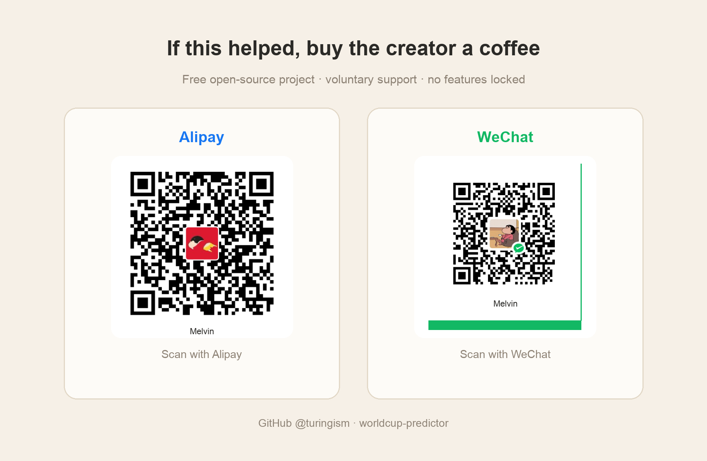
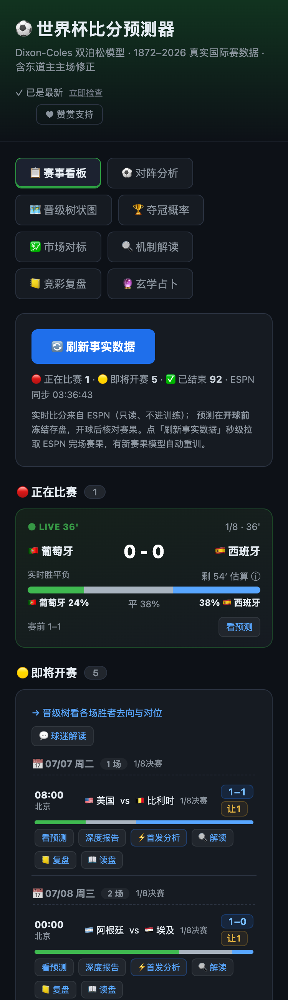
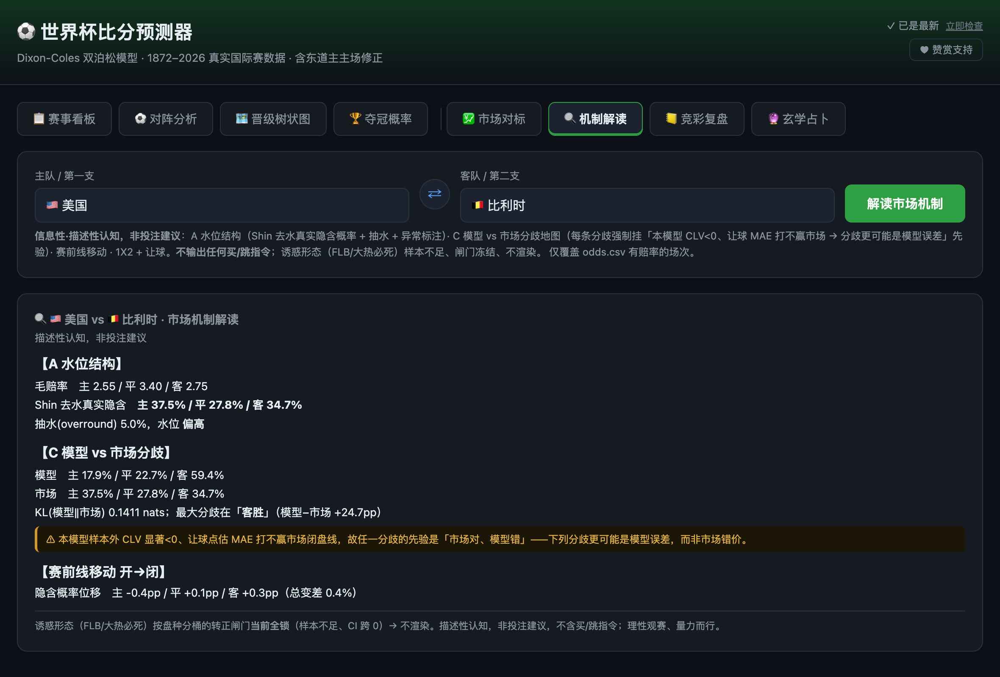
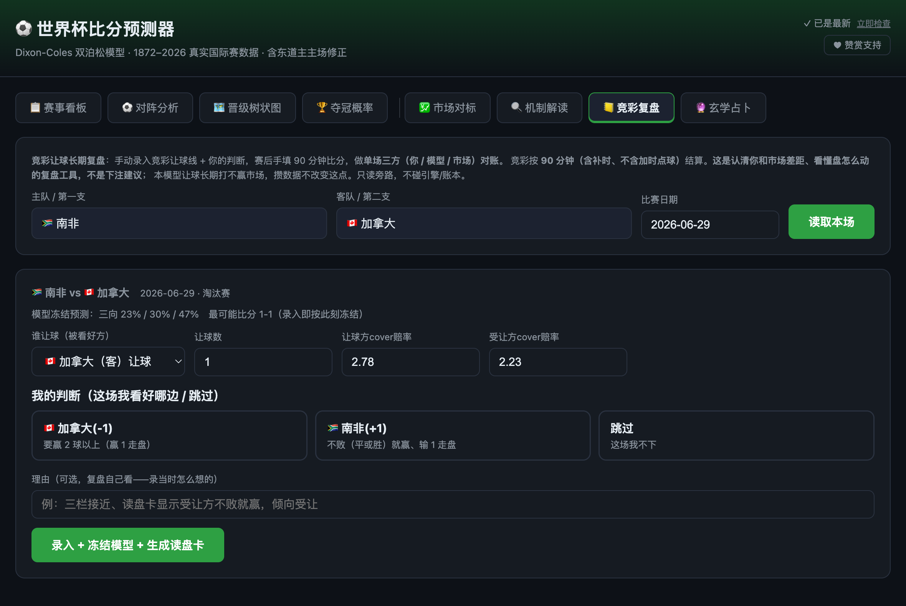

# ⚽ 世界盃比分預測器 · World Cup Score Predictor

<p align="right"><a href="./README.md">English</a> · <a href="./README.zh-CN.md">简体中文</a> · <strong>繁體中文</strong></p>

> ## ⚠️ 免責聲明 / Disclaimer
> 本專案為**個人學習與技術研究的開源作品**，僅用於統計建模、資料分析與程式設計學習目的，**不構成任何形式的投注、投資或決策建議**。作者不對任何人使用本專案的行為、以及由此**直接或間接關聯的任何賭球、博彩等行為及其後果**承擔任何責任。所有輸出均為統計機率估計——**機率不等於確定結果**；博彩長期對絕大多數人期望收益為負，且在許多司法管轄區受法律限制。是否參與、以及由此產生的一切風險與法律責任**完全由使用者自行承擔**。本專案按「現狀」（as-is）提供，不附帶任何明示或默示擔保；使用即視為已閱讀並同意本聲明。
>
> *This is a personal, educational open-source project for statistical modeling and programming study only. It is **not** betting, investment, or any other advice. The author accepts **no liability** for anyone's use of it or for **any gambling/betting activity directly or indirectly associated with it**. All outputs are probabilistic estimates — probability is not certainty; gambling is negative-EV for most people over time and is legally restricted in many jurisdictions. You bear all risk and legal responsibility. Provided "as is" without warranty.*

---

## ☕ 贊賞支持（純自願）

這是一個**免費開源**的個人專案。如果它幫你省了事、或讓你看球多了點樂子，歡迎請作者喝杯咖啡（也可在網頁右上角點「**♥ 贊賞支持**」掃碼）。

<p align="center">
  
</p>

> **贊賞純屬自願，不解鎖任何功能、不構成購買任何預測服務**——所有功能對所有人永久免費。自行部署時把你自己的收款碼圖片替換 `data/sponsor.png` 即可。

---

> **不是又一個「AI 憑感覺吹球」的玩具。** 這是一台用 1872–2026 全量真實國際比賽資料、Dixon‑Coles 雙泊松統計引擎驅動、經樣本外回測校準過的**可互動即時機率機器**——每一個數字都能被回測證偽，每一次刷新都跟著真實賽果走。

<p align="center">
  
  <br><sub><em>賽事看板（首屏）—— 正在比賽 / 即將開賽 / 已結束一屏掌握，按日分組、每場可一鍵看比分預測或直達深度報告；右上角自動偵測儲存庫是否落後遠端 main。</em></sub>
</p>

<p align="center">
  <code>Dixon-Coles 雙泊松</code> · <code>蒙地卡羅模擬</code> · <code>2026 官方賽制括號</code> · <code>ESPN 分鐘級即時</code> · <code>In-play 即時勝平負</code> · <code>貝氏可信區間</code> · <code>Flask 一鍵起網頁</code>
</p>

---

## 🤖 Codex / Claude Skill 就緒

這個儲存庫按「**本地產品 + agent skill**」維護：Codex / Claude 可以啟動 Web UI、守住 `8000` 連接埠、刷新事實資料、核對賽程、產生分享卡截圖、同步更新中英文文件，同時不誤碰預測引擎。

<p align="center">
  
  <br><sub><em>skill 本地開啟的同一個看板：<code>http://127.0.0.1:8000</code>。</em></sub>
</p>

三語 skill 操作說明：

- [Codex / Claude Skill Guide](./docs/CODEX_SKILL.md)
- [Codex / Claude Skill 使用说明（简体）](./docs/CODEX_SKILL.zh-CN.md)
- [Codex / Claude Skill 使用說明（繁體）](./docs/CODEX_SKILL.zh-TW.md)

---

## 🎯 一句話價值

**輸入兩支球隊 → 給你最可能比分、完整比分機率矩陣、勝平負、期望進球(xG)。**
**點一下模擬 → 給你 48 強每一隊的奪冠 / 進決賽 / 四強 / 出線機率，帶 90% 可信區間。**
**開賽之後 → 真實賽果秒級同步、預測隨事實自動重算；比賽進行中，勝平負機率隨比分和剩餘時間即時跳動。**
**事後 → 每場賽前預測開球前凍結存證，逐場核對命中率，誰也別想事後改口。**

別人給你一句「我覺得阿根廷奪冠」，我們給你 **一個帶 90% 可信區間、能被回測證偽、隨真實賽果自動更新的機率分布**——還告訴你這個數字是怎麼算出來的、為什麼可信、以及它有多不確定。

---

## 🆕 這一版新增（開賽期實戰能力）

| 能力 | 一句話 |
|---|---|
| 📋 **賽事看板**（首屏） | 正在比賽 / 即將開賽 / 已結束 三態聚合，一屏掌握全局，每場可彈出比分預測、或一鍵直達該場**深度報告** |
| 🎯 **正確比分機率盤** | 「看預測」彈窗升級為完整**正確比分機率盤**：按比分玩法固定盤面逐檔給出模型機率，大比分(3-0 / 4-0…)帶真實機率自然浮現、並**突顯最可能比分**——外加 總進球>2.5 / 任一方≥3 球 / 雙方進球 機率 + 完整比分矩陣熱力圖。解決了「預測比分為什麼總是小比分」的困惑（眾數≠期望，是統計現象不是 bug） |
| ⚡ **In-play 即時勝平負** | 比賽進行中，用賽前 λ 按剩餘時間縮放 + 當前比分卷積，給出「從現狀到終場」的即時勝平負——**賽前一錘子 → 即時機率引擎** |
| ⚽ **對陣分析深度報告**（足球經理人） | 任選兩隊出資深分析師風格報告：過程資料（近期狀態/歷史交鋒/攻防）→ 演算法模型（Dixon-Coles 比分矩陣 + 熱力圖）→ 結論（1X2 / 大小球 / BTTS / 亞盤 / 正確比分 / 信賴度）。原「單場預測」已併入此處 |
| ⚖️ **讓球機制**（一整套） | 不放選擇器**直接給讓球結論**：全檔(讓0.5→3)掃描 + 模型**公平盤**(讓球後≈五五開)突顯 + 每檔「偏值/公平/偏虧」CP 值；**競彩（中國體育彩票）讓球線按本場動態確定**(讓N/平手)——按模型期望淨勝球定，不再寫死「讓1球」；綜合**全隊淨勝球榜 / 小組即時排名 / 已晉級球隊心態**（已出線→輪換預警，可選啟發式降權）；接 **ESPN/DraftKings 真實讓球盤**做模型公平盤 vs 市場線**背離 + 盤口移動**對標；一座**讓球命中率擂台**用賽前凍結矩陣+真實賽果檢驗競彩讓球命中率(分桶)、公平盤校準、**模型 vs 市場誰更準**(MAE / 期望淨勝 / 打贏閉線 / 讓球 CLV)。誠實結論：**模型讓球打不贏市場閉線**——用數字如實說。看板每場帶「讓X」速覽、看預測彈窗帶讓球速覽+市場對標 |
| 📣 **比賽解讀** | 把模型勝率翻成一句**球迷語言**（球隊暱稱如森巴軍團/高盧雄雞、大熱/勢均/爆冷敘事、進球氛圍），並接**本場動態競彩讓球線**（讓N/平手傾向）。**合規鐵律**內建：違規詞守衛（禁「穩賺/必中/包贏」等擔保/誘導詞，違反即拋）、每條必帶「非投注建議、理性觀賽」尾註、只陳述機率事實不導購。展示在「看預測」彈窗與「對陣分析」報告頭（綠色置頂卡）；**純唯讀、絕不碰預測引擎** |
| 🧩 **首發名單接入** | 對陣分析裡：從 ESPN 拉**確認首發**（約賽前 1 小時公布），與登記關鍵人做布林核對 → 觸發可用性 xG 懲罰 → 展示**賽前(純模型) vs 首發確認**的機率對比。含**明日對戰看板**（點任意場次自動填表分析）+ 完賽**首發增益記分卡**（加入首發資料到底有沒有讓預測更準？對真實賽果打分，誠實小樣本）。唯讀、opt-in，**絕不**碰引擎 / 回測 / 凍結帳本 |
| 🎯 **預測驗證層** | 賽前預測**開球前凍結**存證；逐場核對賽果/比分命中，按信賴度分桶、標註冷門——拿數字逼自己誠實（位於看板「已結束」區） |
| 💹 **市場對標 / CLV** | 模型 vs 博彩閉盤線 + 閉盤線價值(CLV)**可證偽檢驗**；**沒有顯著正 CLV 就不顯示任何「價值/注碼」**——做誠實檢驗，不做下注誘導。門檻現已改為**逐條清單**：把真實 CLV 數字（樣本量 / 平均 CLV / t 值 / 跑贏閉盤比例）與是否達標透明列出——「為什麼價值面板鎖著」完全有據可查 |
| 🔄 **儲存庫更新偵測**（右上角） | 定時 `git fetch` + `rev-list` 比對本地落後遠端 `main` 的提交數（**走 git 協定、不碰 GitHub API**，免限流），告訴你落後幾個提交；15 分鐘快取、斷網優雅降級。發現新版本時提示你**對 Claude 說一句話就能更新**（自動 `git pull` + 重啟） |
| 📈 **奪冠 90% 可信區間 + 實力榜** | 貝氏分層後驗驅動，給奪冠機率配可信區間（參數不確定性），**並**同屏展示其上游的淨實力榜——同一套後驗的上下游兩視圖，新賽果後**自動於背景重算** |
| 🔍 **機制解讀** | 任選對陣出一張**唯讀、描述性**的市場機制卡：Shin 去水真實隱含機率 + 抽水（水位結構）、模型 vs 市場分歧地圖（KL + 逐結果差）、賽前盤口移動——每條分歧**強制掛「市場對、模型錯」先驗**（本模型 CLV 已證 <0）。只陳述認知，**從構造上就發不出任何買入/跳過指令**（違規詞守衛 + 渲染自檢） |
| 📒 **競彩復盤** | 長期**手動復盤閉環**：賽前輸入真實競彩讓球線 + 你自己的判斷（模型預測輸入即凍結），賽後手填 90 分鐘比分，得到**單場三方對帳**——你 / 模型 / 市場各自對錯。它存在的意義是直面一個事實：你和模型長期都打不贏市場；**從 schema 層就禁止聚合成下注訊號**（資料結構裡不存在 ROI / 勝率欄位） |
| 📱 **行動裝置優先看板** | 整個 UI 在 ≤430px 依然成立：三欄緊湊賽程列、比分單行不換行、每場即將開賽帶**三段式勝平負機率條**、彈窗縱向堆疊——手機上零水平捲動 |
| 🔮 **玄學占卜**（文化彩蛋） | 七套傳統術數各按**干支真實起卦、確定性排盤**為每場「占」出比分——並用誠實擂台證明**沒有一套能超過無腦基線**。是文化/演算法趣味實驗，**無科學或預測依據，非投注建議** |

---

## 🔥 為什麼它不一樣（核心賣點）

| 普通「預測」 | 世界盃比分預測器 |
|---|---|
| 拍腦袋、抄熱搜 | **學術級統計模型**：Maher(1982) → Dixon‑Coles(1997) 一脈相承 |
| 一個「誰贏」的結論 | **整張比分機率矩陣** + xG + 勝平負 + Top7 比分 |
| 無法驗證對錯 | **樣本外回測**（RPS / LogLoss / 命中率）逼自己說真話 |
| 賽前算一次就完事 | **開賽期即時引擎**：ESPN 分鐘級完場 → 自動重訓 → 機率隨賽況漂移 |
| 黑箱 | **全程可編輯、可解讀**：改任意比分做假設，括號與奪冠率即時重算 |

> 我們甚至完整拆讀了 Kimi 的 224 頁、300+ agent 世界盃研報，做了兩組對標回測——結論：**把它的核心方法論照搬過來會讓我們更差**。我方單一可回測引擎在同口徑上已是最優。詳見 [對標章節](#-我們和-kimi-研報比過了)。

---

## 🧠 預測引擎：你買到的到底是什麼演算法

### 1. 真實資料，不是模擬資料
- 資料來源 `martj42/international_results`：**1872–2026 全部國家隊比分**。
- 世界盃是國家隊賽事，**俱樂部聯賽資料無效**——我們從根上選對了樣本。

### 2. 雙泊松 GLM + Dixon‑Coles 修正
- 每隊進球服從 Poisson(λ)，用**進攻力 / 防守力 / 主場優勢**建模 log λ，凸最佳化幾秒收斂。
- Dixon‑Coles 相關參數 ρ 專門修正獨立泊松對 **0‑0 / 1‑1 等低分平局**的低估——這是足球建模的學術標準動作。

### 3. 時間衰減加權（回測調出來的，不是猜的）
- 越近的比賽權重越高，**半衰期 730 天**為修復時間洩漏後的樣本外回測最優值。
- 短期狀態 > 歷史聲譽：模型信**近期真實場上證據**，不信光環——同一支隊的近期戰績，比它的名氣更能決定我們給的機率。

### 4. 中立場 / 地主國主場，分得清
- 世界盃多為中立場，主場優勢**只給真正的主隊**（如地主國美 / 墨 / 加在本國城市，+23% xG）。
- 模擬器精確到**城市→地主國對應**，實測把地主國出線率拉到 美 51% / 墨 95% / 加 94%。

### 5. 蒙地卡羅整屆模擬
- 自動從賽程建構 **2026 官方 12 組 + 官方括號 + 最佳第三名分配**。
- 抽小組賽比分 → 算排名 → 出線 32 隊 → 單場淘汰（平局點球模擬）→ 統計每隊各輪頻率。
- **5000 次約 1–2 秒**，奪冠機率帶模擬信賴區間。

---

## 🖥️ 三種用法，從命令列到一鍵網頁

### A. 命令列單場預測
```bash
python3 predict.py "Argentina" "France" --cache    # 支持中文队名，--cache 后秒开
```
```
  ⚽ Argentina  vs  France   (中立场)
  ──────────────────────────────────────────────
  期望进球 (xG):   Argentina 1.17  -  0.75 France

  赛果概率
    Argentina      胜   45.4%  ███████████·············
    平局               30.9%  ███████·················
    France         胜   23.7%  ██████··················

  最可能比分 (Top 7)
    1-0    16.9%   1-1 13.0% ...

  ➜ 最可能比分: Argentina 1-0 France  (16.9%)
```

### B. 命令列奪冠機率
```bash
python3 simulate.py --sims 5000      # 模拟整届，输出夺冠/进决赛/四强/八强/出线概率
```

### C. 一鍵起網頁（核心體驗）
```bash
python3 app.py        # 打开 http://127.0.0.1:8000
```

**網頁八大 Tab——統一圖示、並按「核心 / 對照」兩組劃分——把整個「預測期」做成了一個能玩的即時產品：**

#### 📋 賽事看板（首屏 / 產品入口）
- **三態聚合**：🔴 正在比賽（ESPN 即時比分 + 分鐘 + **即時勝平負條**）/ 🟡 即將開賽（按比賽日分組，帶模型預測比分 + 三向機率）/ ✅ 已結束（逐場核對預測 vs 實際、按把握分桶、標註冷門——**預測驗證帳本**就在這裡）。
- 每場一鍵「**看預測**」→ 彈出**正確比分機率盤**（詳見下節），**與該列機率同口徑**（含地主國主場修正）；每場還帶「**深度報告**」直達對陣分析。
- 開著就自己跑：統一排程器只在該 tab 可見時拉即時比分與完賽（有新完賽即自動重訓模型 + 重算奪冠區間）、博彩盤口每 30 分鐘快照——全程零點擊。「**🔄 刷新事實資料**」用於立即手動拉一次。排程本身也做了強化：即時刷新加**原子節流鎖**、背景任務統一節流口徑、重訓鎖收窄、斷網恢復後**自動補拉**漏掉的資料。整個 UI **響應式下探到 ≤430px 行動裝置斷點**（不溢出），配色全面 **token 化**（平局色獨立、熱力圖高機率格對比度更高）。
- **每一列賽程都是發射台**：除「看預測」與「深度報告」外，每場還帶一鍵直達**機制解讀**與**競彩復盤**的按鈕（對陣與日期自動預填，不用跨 tab 重輸隊名）。淘汰賽列與日期頭帶**階段徽章**（1/8 決賽 / 1/4 決賽…），即將開賽區頂部交叉連結到晉級樹（「這場的勝者去哪、對位誰」）。
- **行動裝置優先**：≤430px 下看板重排為緊湊三欄列，每場即將開賽下方帶**三段式勝平負機率條**（點開可看精確百分比），比分單行、彈窗縱向堆疊——在球場看台上單手可用。
<p align="center">
  
  <br><sub><em>同一個看板在手機上（375px）—— LIVE 即時條、逐場機率條、階段徽章、一鍵直達解讀/復盤。</em></sub>
</p>
- **同源同口徑**：看板「即將開賽」與對陣分析的待賽清單此前一度對同一天比賽數對不上（對陣分析漏場）。根因是待賽過濾誤用了「全歷史交手過的隊對」——把歷史踢過友誼賽的未來對陣（如英格蘭 vs 迦納）刪掉了，少了 15 場。現已改為**只按本屆世界盃已賽過濾**，兩視圖同源同口徑，並加了回歸測試守住。

#### 🎯 正確比分機率盤（看板「看預測」彈窗）
點任意一場的「看預測」→ 彈出一張**正確比分機率盤**：按比分玩法的固定盤面逐檔給出模型機率，**大比分（3-0 / 4-0…）也帶著真實機率自然浮現**，並**突顯最可能比分**。盤面下方附 **總進球 > 2.5 / 任一方 ≥ 3 球 / 雙方進球** 機率，以及**完整比分矩陣熱力圖**。
這解決了一個常見困惑——「預測比分為什麼永遠只顯示小比分？」其實那是**眾數 ≠ 期望**的統計現象（最可能的單一比分往往是 1-0，但機率分布很寬），不是 bug。彈窗底部還帶「**→ 完整對陣分析**」連結，一鍵跳到該對陣的深度報告。
<p align="center">
  
  <br><sub><em>正確比分機率盤——固定盤面逐檔機率 + 突顯最可能比分 + 大小球 / 任一方≥3 / 雙方進球 + 比分矩陣熱力圖。</em></sub>
</p>

#### 📣 比賽解讀（把機率翻成球迷語言）
在「看預測」彈窗與「對陣分析」報告頭各置頂一張**綠色解讀卡**，把模型乾巴巴的勝率翻成一句**球迷語言**：球隊暱稱（森巴軍團 / 高盧雄雞…）、大熱 / 佔優 / 勢均 / 爆冷的敘事、**本場動態競彩讓球線**（讓N 或平手傾向，同樣翻成球迷語言，並明確標註「**模型定線，非官方盤**」），以及進球大戰 / 悶戰的氛圍預判。它**純唯讀、絕不碰預測引擎**——只是把模型已經算出的數字換成人話。**合規由設計保證**：內建違規詞守衛（與機制解讀共用 **73 詞聯集** denylist），禁「穩賺 / 必中 / 包贏」等擔保或誘導下注詞（產生器本就不產出，再加一道執行時守衛，違反即拋）；每條文案必帶「📌 僅為模型機率推演，非投注建議，理性觀賽、量力而行」尾註；只陳述機率與事實，**不導購彩票、不給出票/買入建議**。
<p align="center">
  
  <br><sub><em>比賽解讀卡——把模型機率翻成球迷語言，附本場動態讓球傾向，並內建「非投注建議、理性觀賽」聲明。</em></sub>
</p>

#### 🔄 儲存庫更新偵測（右上角）
頁面右上角會定時跑 `git fetch` + `rev-list`，**比對本地落後遠端 `main` 的提交數**——全程**走 git 協定、不碰 GitHub API**（避免匿名限流），15 分鐘快取、斷網時優雅降級（靜默，不報錯洗版）。一旦發現有新版本，就提示你：**對 Claude 說一句話即可更新**（自動 `git pull` + 重啟），不用記命令、不用切終端機。
<p align="center">
  
  <br><sub><em>儲存庫更新偵測——右上角顯示本地落後遠端的提交數，發現新版本時提示「對 Claude 一句話更新」。</em></sub>
</p>

#### ⚡ In-play 即時勝平負（差異化護城河）
比賽進行中，看板的 LIVE 卡片顯示一條即時勝平負堆疊條：賽前 Dixon‑Coles 的期望進球 λ 按**剩餘時間縮放**，疊加**當前比分**做泊松卷積，得「從現狀到終場」的主勝/平/客勝——隨每一個進球和分鐘跳動。地主國場次與**賽前凍結預測同口徑接入 host + 環境修正**（如美國主場：開球時刻勝率 中立 30.1% → 主場修正 37.3%），即時條與凍結帳本在 t=0 永不打架。**唯讀引擎、嚴格隔離，絕不污染賽前預測的可證偽性。**

#### ⚽ 對陣分析（足球經理人深度報告）
兩隊下拉 + 中立場開關 → 一份**資深分析師風格報告**，三段式：**過程資料**（近期狀態 / 歷史交鋒 / 攻防均值，源自真實歷史）→ **演算法模型**（Dixon-Coles 雙泊松，含**完整比分機率矩陣熱力圖**——原「單場預測」已併入此處）→ **結論**（1X2 / 大小球 1.5·2.5·3.5 / BTTS / 總進球 / 正確比分 / 亞盤讓球 / 競彩讓球 / 半全場 + 勝負傾向與信賴度）。其中**競彩讓球線現按本場動態確定**——N = round(模型期望淨勝球)、clamp[0,6]，不再寫死「讓1球」：強弱懸殊→讓2/讓3（如摩洛哥打海地期望淨勝 1.98→讓2），勢均力敵→平手(讓0，等同常規勝平負，如德國vs厄瓜多)，再按該線判讓勝(淨勝>N)/讓平(淨勝=N)/讓負(淨勝<N)。定性維度（陣型/首發/天氣）如實標註「引擎不提供」，半全場標低信賴度。支援**深連結直達指定對陣**（`#manager?h=&a=`），看板每場的「深度報告」、看預測彈窗的「→ 完整對陣分析」都直接跳到這裡。
<p align="center"></p>

**🧩 首發名單接入**（opt-in「⚡ 拉首發重算」）：陣型/首發原本標註「引擎不提供」——現在賽前約 1 小時從 ESPN 拉**確認首發**，與登記關鍵人做布林核對，展示**賽前(純模型) vs 首發確認**的機率對比（例：某強隊 3 名關鍵球員確認缺陣，取勝 90.7% → 86.8%）。**明日對戰看板**可點任意場次自動填表分析，完賽後**首發增益記分卡**用真實賽果檢驗「加入首發資料有沒有讓預測更準」（誠實、小樣本）。全程唯讀 & opt-in，**絕不**碰引擎 / 回測 / 凍結帳本。
<p align="center"></p>

#### 🌳 本屆即時晉級樹
- **2026 官方賽制**：12 組 + 官方括號 + 最佳第三名分配，投影最可能的官方括號與冠軍。
- 真實賽果藍色鎖定，其餘按模型預測；**全程可編輯**：改任意比分 / 輸入或假設淘汰賽結果（平局可設點球勝者）→ 括號 + 奪冠機率即時重算；輸入自動存檔、重新整理不丟。
- 每場標註日期 + 北京/當地時間切換 + 狀態。與奪冠機率 tab 交叉連結（一條最可能**路徑** vs 完整機率**分布**）。
<p align="center"></p>

#### 🏆 奪冠機率 + 實力榜
- 一鍵蒙地卡羅點估 + 晉級漏斗（出線→八強→四強→決賽→奪冠），條件化在你輸入/假設的賽果上。
- **貝氏分層後驗驅動的 90% 可信區間**（whisker 圖）：區間寬且重疊＝奪冠次序本就高度不確定。新賽果後**於背景自動重算**。
- **實力榜**（貝氏淨實力 + 94% 可信區間）同屏置於其下，作為奪冠區間的**上游**——同一套後驗，一個看球隊實力、一個看它經括號傳播後的奪冠%。情境因素（模型 vs 名氣解讀、關鍵球員傷停、海拔/高溫）摺疊在下方。
<p align="center"></p>

#### 💹 市場對標 / CLV
- 模型 vs 博彩閉盤線 + CLV 可證偽檢驗；**理性博彩護欄 + 嚴格門檻**——無顯著正 CLV 不顯示任何價值/Kelly 注碼。
  - *賠率從哪來*：復用我們抓比分的同一個 **ESPN 公開 API**，其 `pickcenter` 帶 **DraftKings 的 1X2 美式賠率**——**不抓博彩/賠率入口網站**（其 ToS 禁止）。app 執行期間每 ~30 分鐘（及每次刷新）快照一次盤口，於是每場比賽逐步累積**開盤**（首次快照）與**閉盤**（開球前最後一次）線——正是 CLV 所需。
  - *CLV 怎麼累積*：一場比賽只有**已完賽**且我們跨時段抓到過它的盤口，才進入 CLV 統計。所以開賽初期會誠實顯示「樣本不足」，隨比賽推進逐步填充。價值/Kelly 面板**僅當**模型呈現統計顯著的正 CLV（≥30 場、t>1.65）才解鎖，否則保持鎖定。「看示範」按鈕用**明確標註的合成資料**展示解鎖後的樣子。
  - *門檻改為逐條清單*：不再只甩一句「鎖定/解鎖」，而是把真實 CLV 數字**逐條**列給你——**樣本量 / 平均 CLV / t 值 / 跑贏閉盤比例**，每一條都標註是否達標（如 ≥30 場、t>1.65）。「為什麼價值面板鎖著」從此完全有據可查，這是反「穩贏」暗示的誠實層。
  - *它可能永遠不會打開——而這正是它最值錢的地方：不騙你。* 跑贏閉盤線極難，若模型沒有真優勢，它會誠實地一直鎖著，而不是給你一個看著唬人、其實是雜訊的數字。
<p align="center">
  
  <br><sub><em>CLV 誠實門檻逐條清單——真實數字透明展示，每條標註是否達標，價值面板鎖著的原因一目了然。</em></sub>
</p>

#### 🔍 機制解讀（描述性市場認知——絕不是指令）
任選對陣（或從看板一鍵直達）出一張**唯讀市場機制卡**：**A 水位結構**——Shin 去水後的真實隱含機率、莊家抽水（overround）與水位異常標註；**C 模型 vs 市場分歧地圖**——KL 散度 + 逐結果機率差，且**每條分歧都強制配「市場對、模型錯」先驗橫幅**（本模型樣本外 CLV 已證顯著 <0、讓球點估 MAE 打不贏市場閉盤線——分歧更可能是模型誤差，而非市場錯價，這句話用琥珀色寫在每張卡上）；外加**賽前線移動**（開盤→閉盤隱含機率位移）與讓球盤的同款 2 路 Shin 去水。「誘惑形態」段（大熱必死/FLB 命名）**凍結在統計閘門後**——按盤種分桶，n ≥ 30 且信賴區間不跨 0 才解鎖，達標前根本不渲染。**從構造上它就發不出任何買入/跳過/價值指令**：違規詞 denylist + 渲染時自檢雙重守衛（違反即拋出例外，測試套件為每個渲染分支釘了反例）。
<p align="center"></p>

#### 📒 競彩復盤（長期誠實鏡子，不是薦單）
一個圍繞競彩讓球的**手動單場復盤閉環**：賽前輸入真實競彩讓球線 + 雙邊 cover 賠率 + **你自己的判斷**（看好讓球方 / 看好受讓方 / 跳過，可附一句理由）——模型的三向機率與最可能比分在**輸入那一刻凍結**。賽後手填 **90 分鐘比分**（介面會提醒：競彩按 90 分鐘結算，加時點球只決定晉級、不進本盤），tab 自動做**單場三方對帳：你 / 模型 / 市場**，各自判 對 / 錯 / 走盤（走盤全員 void 不計；你選「跳過」則你那列不計分）。派生的**讀盤卡**把讓球線翻成帶真實隊名的大白話（「加拿大(-1) 要贏 2 球以上；恰好贏 1 球走盤退回」）——純規則翻譯、零方向。這個 tab 存在的意義，是讓一個事實隨時間可見：**你的判斷和這個模型，長期都打不贏市場閉盤線**——並且它**從 schema 層就被禁止變成薦單引擎**：資料結構裡不存在 ROI / 盈虧 / 任何「率」欄位，跨場聚合成行動訊號在設計層直接拒絕，測試套件斷言這些欄位永不出現。
<p align="center"></p>

#### 🔮 玄學占卜（文化彩蛋——明確**不是預測**）
一個趣味的**確定性**圖層，把每場比賽交給**七套中國傳統術數**各占一卦：**梅花易數 / 射覆 / 周易·六十四卦 / 六爻納甲 / 奇門遁甲 / 大六壬 / 紫微斗數**。每一套都按**開球時刻的干支時間柱真實排盤**驅動（年/日/時柱精確、月建按真太陽黃經定節氣、給定球場經度時還會先校**真太陽時**）：奇門真有陰陽遁/三元定局/三奇六儀/九星八門八神，六爻真有京房八宮定世應/納甲六親，大六壬真有月將加占時排天地盤/四課/九宗門發三傳，紫微真有安星/廟旺利陷/生年四化……隊名只進一層很薄的**取用層**（分主客、區分同一時刻的不同對陣），**絕不灌入真實球隊實力**。

> **這是文化/演算法趣味實驗，無任何科學或預測依據——切勿用於投注或任何現實決策。** 而且這個 tab 對此很誠實：內建一座**擂台把七法和無腦基線**（永遠押主勝 / 全押最常見比分 / 隨機）放在一起比，既比本屆賽前凍結的占卜、**也比一份 4.9 萬+場的歷史回測**——結果是**沒有一套術數能超過基線**（七法全部貼近隨機 ~1/3，遠低於 ~49% 的「永遠押主勝」線）。**排盤越正統、卻照樣贏不了基線——這正是它要說的話。**

<p align="center"></p>

---

## 📊 我們用數字逼自己說真話（回測）

### 📈 準確率一覽（樣本外 · ~1388 場國際賽）

| 指標 | 數值 | 含義 |
|---|---|---|
| **RPS** | **0.1624** | 排序機率得分，越小越好——博彩閉盤線量級 |
| **勝平負命中率** | **59.7%** | 三向 argmax 準確率 |
| **校準 ECE** | **1.06%** | 產業基準 8–10%，**我們天生更校準** |
| **淨勝球相關** | **65%** | 高盛同口徑指標（其僅世界盃正賽自評 ~45–49%；樣本群不同，僅作量級參照） |

*只用 cutoff 之前資料訓練、預測之後的真實比賽（無洩漏）。`python3 backtest.py` 可復現。本屆逐場核對（賽前預測開球前凍結、事後打分）在「預測驗證」tab——開賽初期小樣本（如 8 場裡 3 場平局）會讓命中率劇烈波動，所以上面的長期 ~60% 才是誠實基線。*

### 🎯 本屆實測驗證：命中率正在趨近真值

經過 **36 場已完賽**，實測勝平負命中率為 **55.6%**——這個數字背後是一個誠實的故事。開賽初期只有 8 場（其中 3 場平局）時，它只有 **37.5%**；而樣本外回測的真實水準約為 **59.5%**（在 2420 場上復現）。關鍵在於：8 場樣本與 36 場樣本的 95% 信賴區間**都涵蓋 59.5%**——在統計意義上它們是**同一個數**。**命中率上升不是模型變強，而是樣本變多後的均值回歸。** 引擎自修復時間洩漏後就再沒動過，所以這次趨近恰恰證明了它穩定、有效——不是運氣，也沒有偷偷改動。

<p align="center">
  
  <br><sub><em>預測驗證記分卡（看板「已結束」區）——逐場核對賽果 / 比分命中，按把握分桶，並誠實標註失手歸因。</em></sub>
</p>

- 在 **25 場決勝場**上模型命中 **80%**；全部 **11 場平局**（佔樣本 30.6%）是結構性丟失——取機率最大項時幾乎不會選「平局」，這是**所有機率模型**的共同天花板，並非缺陷。
- **校準依舊成立**：用蒙地卡羅零分布可證，一個**完美校準**的模型在 n=36 下，ECE 均值本就有 **6.02%**；而我們實測只有 **4.47%**，反而**更低**（p=0.72）。本屆機率是誠實校準的。

改任何模型 / 參數，**必須跑 `python3 backtest.py` 用 RPS / LogLoss / 命中率證明更好，否則不採用**。這是專案鐵律。

```bash
python3 backtest.py     # 只用 cutoff 之前数据训练，预测之后真实比赛
```

樣本外校準成績（修復時間洩漏後誠實口徑）：
- **訓練集 ECE = 1.06%**（Kimi 自述產業基準 8–10%、<5% 算良好）——我們**天生就比產業基準更校準**。
- 可靠性對角線近乎完美：預測 .95 → 實際 .944。

被回測**否決**、因此預設關閉的「看起來很美」的改動（避免你交智商稅）：

| 試過的「高級」改動 | 回測結論 |
|---|---|
| 身價 / 轉會市值先驗 | 對機率準度無改善 → 關閉（數值仍在 UI 展示） |
| 動態 Elo 評級（替代 / 集成 / 收縮先驗） | 被 Dixon‑Coles 進球級資訊支配 → 不整合 |
| 賽事強度分級加權 | 砍有效樣本、升變異數 → 全部更差 |
| 負二項過度離散 | GLM 扣實力後殘差近 Poisson → 單調更差 |
| Isotonic / Platt 後校準 | 我方已足夠校準 → 後校準只會過度擬合 |

> **這恰恰是賣點**：不是功能少，是我們替你試過了所有花俏方案，留下來的每一項都有回測背書。

#### 2026-06 優化 sprint —— 5 個槓桿，全部被回測否決

本屆打滿 36 場後，我們做了一次多 agent 優化 sprint，想再從引擎裡榨出一點。每個槓桿都用**防洩漏的 fresh 模型、訓練 / 留出拆分、對抗驗證**嚴格檢驗；採納門檻=池化 RPS 改善 > 0.0008 且在最近 cutoff 上不變差。結果五個全部誠實否決：

| 試過的槓桿 | 回測結論 |
|---|---|
| 平局決策規則 | argmax 已是命中率最優；表面增益在輪換留出集上無法泛化 |
| 中立場名義主場傾斜 | 發現了**真實**偏差（主隊槽位被低估 +2.24pp），但只換來 +0.0002 RPS——只有門檻的 1/4，且是窄峰 |
| Dixon‑Coles ρ 近期性重擬 | +0.000008 RPS——惰性槓桿，低分結構跨時代穩定 |
| 分洲差異化半衰期 | 雜訊（−0.00001 RPS）；在平底盆地上加自由度只會抬變異數 |
| 本屆重新校準 | 本就已校準（見上）——重校準只會過度擬合，與已否決的 isotonic 同理 |

> 一個都沒採納，而這正是正確結果。**命中率與 RPS 已貼近雙泊松模型在本資料上的資訊上限**——剩餘誤差是結構性的（平局盲區）加小樣本雜訊，而非可修復的系統偏差。完整數字見 `CHANGELOG.md`。

---

## 🆚 我們和 Kimi 研報比過了

完整讀完 Kimi 224 頁 / 300+ agent / 20 維度的 2026 世界盃報告後，做了兩組對標回測，結論清晰：

- **Kimi 強在廣度與敘事**（地緣 / 傷病 / 天氣 / 海拔 / 戰術相剋 / 黑天鵝），**弱在可證偽性**（多為定性，冠軍機率上限自承 ≤25%）。
- **我方強在單一可回測引擎 + 真實場上證據 + 校準**。把 Kimi 的 Elo 收縮先驗、後校準照搬過來，**回測全部單調惡化**。
- 兩者非同類：**Kimi 像研報，我方像可互動的即時機率引擎。**

> 修復早期一處時間洩漏後，我方奪冠榜（阿根廷 / 西班牙 / 英格蘭領跑）已與市場共識同量級；曾經「挪威排很前、法國偏後」的分歧主要是洩漏偽影。誠實記帳、發現就改——詳見 `CHANGELOG.md`。

---

## 🚀 快速開始

> 📓 比賽日運行看一頁紙 **[比賽日運行手冊](./docs/RUNBOOK.zh-CN.md)**。

```bash
# 1) 依赖（anaconda 通常已自带 numpy/pandas/scipy/statsmodels/flask）
pip install -r requirements.txt

# 2) 数据已自带 data/results.csv；要更新再跑
python3 download_data.py

# 3) 预测（首次训练约 1 分钟，--cache 后秒开）
python3 predict.py "Argentina" "France" --cache

# 4) 起网页
python3 app.py        # http://127.0.0.1:8000
```

### 在你自己的程式碼裡呼叫
```python
import data
from model import DixonColesModel

m = DixonColesModel(half_life_days=730).fit(data.load_raw())
r = m.predict("Argentina", "France", neutral=True)
print(r["top_scores"][0])   # ((1, 0), 0.169)
print(r["p_home"], r["p_draw"], r["p_away"])
print(r["matrix"])          # 11x11 完整比分概率矩阵
```

---

## 📁 工程一覽

```
worldcup-predictor/
├── data.py        数据层：清洗 + 时间/赛事加权 + 长表 + 实时赛果合并
├── model.py       DixonColesModel：GLM + ρ 修正 + 比分矩阵
├── predict.py     CLI：单场 / 实力榜 / 赛程批量
├── simulate.py    蒙特卡洛：整届模拟 → 夺冠概率（含东道主主场）
├── wc2026.py      2026 官方赛制：分组 + 官方括号 + 第三名分配
├── schedule.py    全 104 场开球时间 + 场馆/当地时间换算
├── live.py        ESPN 实时层：完场抓取 + 进行中状态（分钟级、含点球）
├── ganzhi.py      干支 / 节气时间柱推算（由开球时刻定年/日/时柱 + 真太阳时）
├── xuanxue.py     🔮 玄学占卜引擎：7 套传统术数，确定性忠实排盘
├── xuanxue_board.py  🔮 玄学擂台：赛前冻结账本 + 诚实基线 + 历史回测
├── inplay.py      ⚡ In-play 实时胜平负（赛前 λ 缩放 + 当前比分卷积）
├── manager.py     ⚽ 对阵分析报告（只读组装：过程数据 + DC 比分矩阵 + 衍生盘口 + 让球结论/动机/市场对标）
├── standings.py   ⚖️ 上下文表（只读）：全队净胜球榜 + 小组实时排名 + 已出线检测（动机层输入）
├── handicap_ledger.py ⚖️ 让球命中率擂台：赛前冻结矩阵结算竞彩命中率/公平盘校准/模型 vs 市场/让球 CLV
├── narrative.py   📣 比赛解读文案层（球迷语言 + 违规词守卫，纯展示）
├── explainer.py   🔍 机制解读：Shin 去水水位结构 + 模型vs市场分歧（强制「市场对」先验）+ 线移动；违规词守卫
├── jc_review.py   📒 竞彩复盘：手动录入竞彩线 + 模型冻结 + 90分钟结算 + 你/模型/市场三方对账（原子写；schema 层禁"率"/ROI 字段）
├── espn_odds.py   💹 盘口快照（ESPN/DraftKings 1X2 + 让球），代理/直连双通道重试
├── env.py         环境层：主办城市海拔/高温修正系数（供 in-play 与验证层同口径调用）
├── verify.py      🎯 预测验证：赛前冻结存证 + 逐场核对 + 分桶/冷门
├── clv.py         💹 市场对标 / CLV 诚实检验 + EV/分数 Kelly（门槛 gating）
├── bayes.py       PyMC 分层贝叶斯评级（补充视图）+ 导出后验抽样
├── champ_ci.py    📈 夺冠概率 90% 可信区间（bayes 后验驱动 MC）
├── backtest.py    样本外回测（RPS / LogLoss / 命中率）；bt_*.py 各类对比回测
├── app.py         Flask 后端（看板/预测/模拟/验证/市场/区间 + 后台自动重算 + 更新检测）
├── test_core.py   回归测试（84 项：预测合理性 / 矩阵归一 / API 冒烟 / 红线守卫 / 并发安全 / …）
└── templates/index.html   单页 UI（看板 + 正确比分概率盘 + 热力图 + 晋级树 + 夺冠榜 + 区间 + 市场 + 更新检测）
```

---

## 📚 方法出處（站在巨人肩上）
- **Maher (1982)** — 泊松建模足球進球
- **Dixon & Coles (1997)** — 低分相關修正 + 時間加權
- **Lee (1997)** — 雙泊松獨立模型

---

<p align="center">
  <strong>⚽ 看球之前，先看機率。</strong><br>
  <em>真實資料驅動 · 樣本外校準 · 即時隨賽況更新 —— 一台你能親手撥動的世界盃機率機器。</em>
</p>
