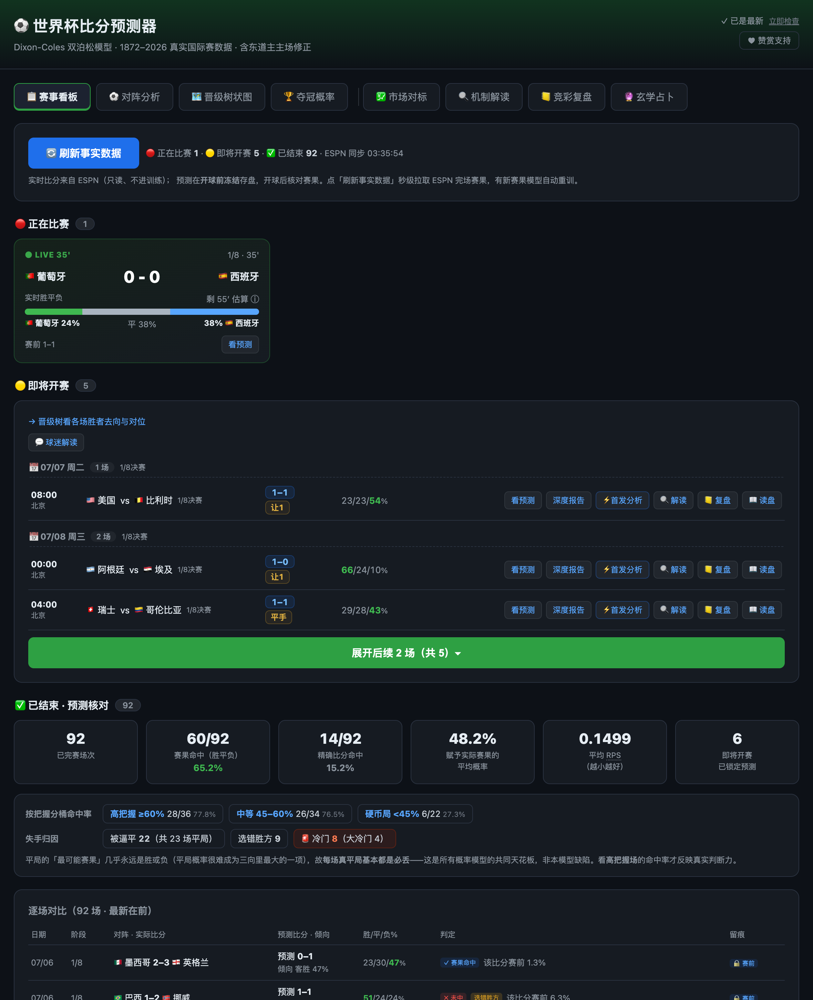

# ⚽ 頂級足球賽事預測器

<p align="right"><a href="./README.md">English</a> · <a href="./README.zh-CN.md">简体中文</a> · <strong>繁體中文</strong></p>

### **[▶ 開啟線上版](https://turingism.github.io/worldcup-predictor/)** —— 不用安裝、不用配 API key

Dixon-Coles 雙泊松引擎，以 1872–2026 全部國際比賽訓練，另有歐洲五大聯賽各自獨立的俱樂部模型。每個數字都可證偽：任何模型改動**必須在樣本外回測裡贏過基線**，否則不採用。

> ## ⚠️ 免責聲明 / Disclaimer
> 本專案為**個人學習與技術研究的開源作品**，僅用於統計建模、資料分析與程式設計學習目的，**不構成任何形式的投注、投資或決策建議**。作者不對任何人使用本專案的行為、以及由此**直接或間接關聯的任何賭球、博彩等行為及其後果**承擔任何責任。所有輸出均為統計機率估計——**機率不等於確定結果**；博彩長期對絕大多數人期望收益為負，且在許多司法管轄區受法律限制。是否參與、以及由此產生的一切風險與法律責任**完全由使用者自行承擔**。本專案按「現狀」（as-is）提供，不附帶任何明示或默示擔保；使用即視為已閱讀並同意本聲明。
>
> *This is a personal, educational open-source project for statistical modeling and programming study only. It is **not** betting, investment, or any other advice. The author accepts **no liability** for anyone's use of it or for **any gambling/betting activity directly or indirectly associated with it**. All outputs are probabilistic estimates — probability is not certainty; gambling is negative-EV for most people over time and is legally restricted in many jurisdictions. You bear all risk and legal responsibility. Provided "as is" without warranty.*

<p align="center">
  
</p>

---

## 兩個模型宇宙，同一套引擎

| | 國家隊 | 俱樂部 |
|---|---|---|
| 資料 | 1872–2026 全部國際賽，257 支球隊 | football-data.co.uk，五大聯賽 |
| 半衰期 | 730 天 | 365 天 |
| 涵蓋 | 世界盃 2026、歐國聯——引擎層面今天就能預測任意國家隊對陣 | 英超 / 西甲 / 義甲 / 德甲 / 法甲 |
| 賽事視圖 | 含地主主場修正的蒙地卡羅晉級樹、帶貝葉斯區間帶的奪冠機率 | 賽季模擬器：奪冠 / 前四 / 降級機率 |

兩個半衰期都是回測裁決出來的，不是拍腦袋定的，而且**確實不同**——別把一個宇宙的超參照搬到另一個。

**每場比賽給什麼**：比分機率矩陣、勝平負、大小球、雙方進球、亞盤公平線、一份分析師風格的賽前深度報告（近期狀態 / 歷史交鋒 / 攻防評級），以及一段把機率翻成人話的解讀。

**怎麼保證誠實**：預測在**開球前凍結**進驗證帳本，賽後逐場對帳——按信心度分桶、標註失手歸因。市場 / CLV 層拿模型對標博彩收盤線，並如實報告：**模型打不贏市場**。

完整功能走查（含全部截圖）見 **[`docs/FEATURES.zh-TW.md`](./docs/FEATURES.zh-TW.md)**。

---

## 準確度

樣本外、約 1388 場國際比賽，只用截止日之前的資料訓練：

| 指標 | 數值 | |
|---|---|---|
| **RPS** | **0.1624** | 越低越好，已在博彩收盤線的量級 |
| **勝平負命中率** | **59.7%** | 三向 argmax，**全部**國際賽口徑 |
| **校準誤差 ECE** | **1.06%** | 對照業界基準 8–10% |
| **淨勝球相關係數** | **65%** | 高盛自己用的指標 |

要引用就引用**分層數字**，別引用這個混合口徑。**僅世界盃正賽**（2014/18/22/26 合併，n=295）是 RPS 0.186 / 命中 61.0% CI[55.6, 66.8]——而在 2026 年同一批比賽上，**博彩收盤線仍然贏過模型**（0.1462 vs 0.1514）。這個差距被如實報告而不是藏起來，這也正是本專案任何地方都沒有投注建議介面的原因。

那些聽起來很聰明、但**被回測否決**的做法（省得你交學費）：身價先驗 · 動態 Elo（替換 / 集成 / 收縮先驗三種形態）· 賽事分級加權 · 負二項過離散 · Isotonic/Platt 後校準 · 平局決策規則 · 中立場傾斜 · ρ 近期性重擬 · 分洲半衰期。

> 剩下的誤差是**結構性**的——所有機率模型共有的平局盲區——外加小樣本雜訊，不是可調參修掉的系統偏誤。數字與方法見 **[`docs/backtest.md`](./docs/backtest.md)** 與 `CHANGELOG.md`。

---

## 自己跑

```bash
git clone https://github.com/turingism/worldcup-predictor.git
cd worldcup-predictor
pip install -r requirements.txt

python3 app.py                                    # 網頁版 → http://127.0.0.1:8000
python3 predict.py "Argentina" "France" --cache   # 國家隊單場
python3 clubpredict.py "阿森納" "曼城"              # 俱樂部單場（聯賽自動辨識）
python3 simulate.py --sims 5000                   # 奪冠機率
python3 backtest.py                               # 證明你的改動真的更好
```

首次執行訓練模型約 1 分鐘並快取，之後秒出。隊名中英文都認。`READONLY=1 python3 app.py` 啟動唯讀分享模式，全部寫介面停用。比賽日維運見 **[`docs/RUNBOOK.zh-TW.md`](./docs/RUNBOOK.zh-TW.md)**。

```python
import data
from model import DixonColesModel

m = DixonColesModel(half_life_days=730).fit(data.load_raw())
r = m.predict("Argentina", "France", neutral=True)
r["top_scores"][0]      # ((1, 0), 0.169)
r["p_home"], r["p_draw"], r["p_away"]
r["matrix"]             # 完整比分機率矩陣
```

---

## 線上版是怎麼搭的

線上版是託管在 GitHub Pages 上的**凍結靜態快照**，沒有伺服器。

這是**刻意的架構選擇，不是妥協**。本應用實測：一次冷啟動的回溯驗證峰值記憶體約 **3 GB**，光 `/api/market` 一個介面就再吃 **873 MB**，預熱快取要 **262 秒**。沒有任何免費託管執行環境扛得住。但在凍結快照下，每個讀介面都是資料的確定函數——於是把這些**全部移進建置期**，而 GitHub Actions 給公開儲存庫的是免費且無限量的 4 核 / 16GB runner。workflow 訓練模型、烤熱全部快取、把整個 API 面預先算成 JSON 再發布。線上執行時記憶體為零，首屏就是一次 CDN 檔案讀取。

```bash
python3 warmup.py                      # 訓練 + 烤熱快取
python3 export_static.py --out dist    # 預先算出 API 面
```

前端只加了一層轉接：`apiFetch()` 用正規化查詢字串的 FNV-1a 確定性雜湊直接算出預算檔案的路徑，零索引、零預載。動態模式下 `STATIC_MODE` 為 `false`，`apiFetch` 就是 `fetch` 本身，自建部署的行為與從前完全一致。兩側的雜湊契約由黃金向量測試釘死——一旦口徑悄悄漂移，整站取數都會 404。

靜態快照做不到的事：即時 in-play 更新，以及全部寫操作（重新整理、假設賽果、手動輸入）。這些在你自建部署時都有，而 `READONLY=1` 本來就停用它們，所以兩種模式口徑一致。

---

## 檔案地圖

| | |
|---|---|
| `model.py` `data.py` `predict.py` | Dixon-Coles 引擎、資料層、單場 CLI |
| `simulate.py` `wc2026.py` `schedule.py` | 蒙地卡羅賽事模擬、官方賽制、賽程 |
| `clubdata.py` `clubpredict.py` `clubsim.py` | 俱樂部資料層、各聯賽模型、賽季模擬器 |
| `verify.py` `clubverify.py` | 賽前凍結與賽後結算 |
| `clv.py` `market_research.py` `explainer.py` | 市場對標、線移動研究、機制解讀 |
| `home_dashboard.py` `manager.py` `narrative.py` | 跨賽事首頁總覽、深度報告、人話解讀層 |
| `bayes.py` `champ_ci.py` `inplay.py` | 分層貝葉斯評級、奪冠區間帶、即時勝平負 |
| `export_static.py` `warmup.py` | 靜態快照建置 |
| `app.py` `templates/index.html` | Flask 後端、單頁前端 |
| `test_core.py` | 212 項回歸測試 |
| `docs/` | 功能走查、回測、資料源、方法說明、維運手冊 |

給 AI 編碼助手的操作手冊：**[`skill/SKILL.md`](./skill/SKILL.md)**。

---

## 方法源流

Maher (1982) 泊松進球建模 · Dixon & Coles (1997) 低比分相關性修正與時間加權 · Lee (1997) 獨立雙泊松基線 · Shin (1992) 去抽水用於讀市場價格 · Fjelstul World Cup DB 用於重構 90 分鐘比分 · martj42 國際比賽結果資料集 · football-data.co.uk 俱樂部資料與賠率。

---

## ☕ 贊賞支持（純自願）

免費開源專案。如果它讓你看球多了點樂趣，歡迎請作者喝杯咖啡。

<p align="center">
  
</p>

> 贊賞**不解鎖任何功能**，也不構成購買任何預測服務。所有功能對所有人永久免費。自建部署時把 `data/sponsor.png` 換成你自己的收款碼即可。
