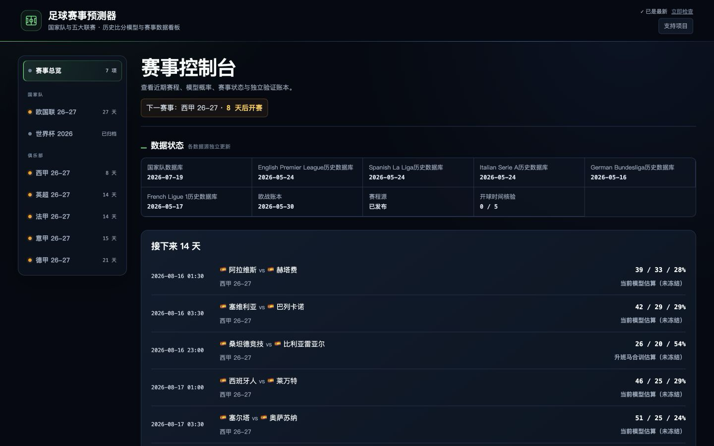
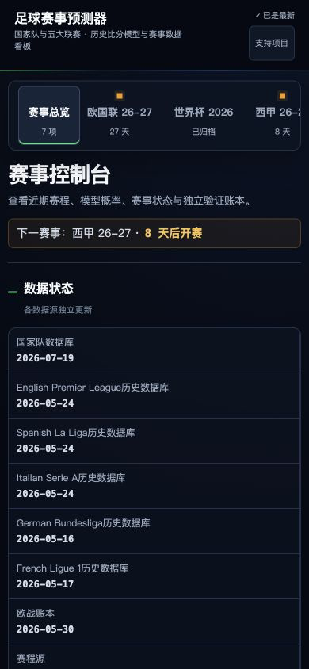
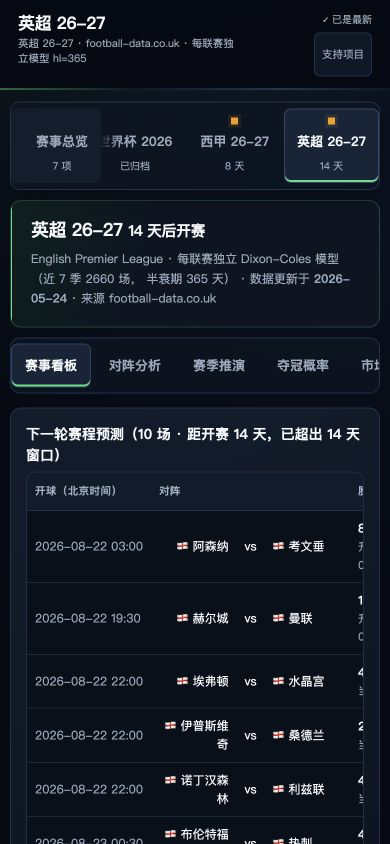
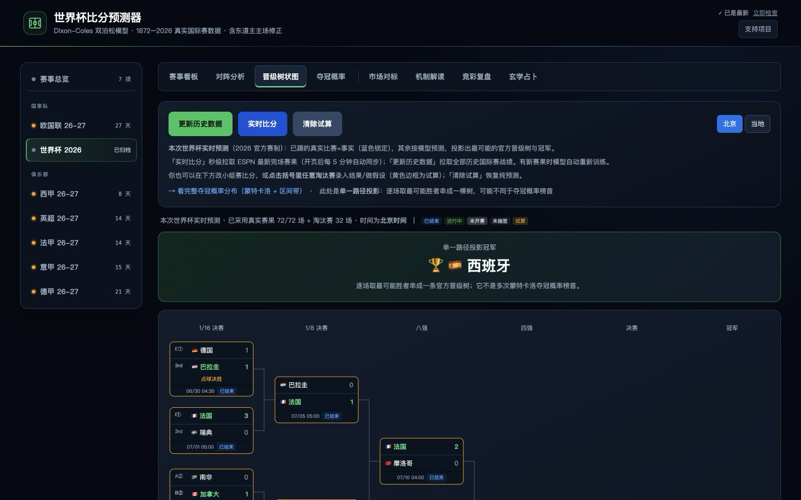

# Football Events Predictor: Complete Product Guide

<strong>English</strong> · <a href="./FEATURES.zh-CN.md">简体中文</a>

This guide describes the current UI v2 across the cross-event homepage, World Cup, Nations League, and Europe's top five leagues. The product has three layers: competition overview, competition features, and match analysis.

## 1. Competition Console

The application opens on `#home`. The homepage is not another event-detail page; it summarizes the state of the entire system.

  

The homepage presents, in order:

1. **Next competition**: time until the nearest event or season begins.
2. **Data status**: national database, top-five history, European ledger, schedule source, and kickoff-time verification.
3. **Upcoming match stream**: the next 14 days across competitions, with Beijing time, fixture, and W/D/L probabilities.
4. **Competition directory**: national and club groups, each card showing season state, data cutoff, and readiness.
5. **Verification ledgers**: one card per competition; empty events may share one empty-state message, but their statistics are never pooled.
6. **Coverage**: factual counts for teams, matches, and seasons currently in the database.

Homepage probabilities follow a fixed priority:

- A frozen fixture uses its pre-match value and displays `frozen_at`.
- A fixture that is not yet frozen but is available on the event dashboard displays “current model estimate (not frozen).”
- Unsupported model or data states remain explicit empty states; the interface does not invent a value.

## 2. Global navigation and responsive shell

Desktop uses a 220px event sidebar with a fluid content column. The sidebar groups national-team and club competitions and displays countdown, live, or archived states.

At widths up to 900px:

- The sidebar becomes a horizontal event rail.
- The active competition scrolls into view.
- The Competition Console remains anchored at the beginning.
- Feature tabs stay on one row and scroll independently.

At widths up to 620px:

- Cards, forms, and status blocks become single-column.
- Match inputs stack vertically and the swap control reflects the new direction.
- Secondary controls and navigation targets maintain a minimum 44px height.
- Wide tables move into `.hscroll`; the document root remains free of horizontal overflow.

  
  &nbsp;&nbsp;
  

## 3. Event Dashboard

The Event Dashboard is the default detail page for each competition.

### National-team competitions

The World Cup dashboard includes:

- Finished, live, and upcoming match states.
- Pre-match frozen probabilities and post-match actual results.
- W/D/L result checks, scoreline checks, RPS, and confidence buckets.
- Per-match score-matrix and deep-analysis entry points.
- ESPN live-result reads and local data refreshes.

### Club leagues

Top-five league dashboards include:

- The next round or the next 14 days of fixtures.
- W/D/L probabilities, expected goals, probability bars, and available B365 fields.
- The latest completed matchday and current table.
- Season, data cutoff, fixture source, and modeling-basis notes.
- Frozen values when available; otherwise a clearly labeled current estimate.

When a promoted club lacks sufficient top-flight history, the system uses the corresponding feeder-league co-trained model. Every affected row states the promoted-team basis and feeder weight instead of presenting it as the same model as an established top-flight fixture.

## 4. Match Analysis

Match Analysis turns one fixture into a complete report.

Inputs:

- Home / first team.
- Away / second team.
- National-team pages may select a neutral venue; league pages use real home/away status.
- Deep links can carry a fixture directly through `?h=&a=`.

Outputs:

- W/D/L probabilities, most likely score, and expected goals.
- A 6×6 or complete score-probability matrix.
- Recent form, home/away split, head-to-head history, and attack/defence strength.
- Derived totals, both-teams-to-score, goal-count, and handicap distributions.
- Schedule, venue, kickoff time, and available player-status context.

National-team pages can read ESPN confirmed lineups roughly one hour before kickoff and show the difference between the pure model and the lineup-confirmed view. This is a fixture-level context input; it does not rewrite the historical training set.

## 5. World Cup bracket

The World Cup follows the official 2026 format: 12 groups, a round of 32, and best-third-place allocation.

  

The bracket supports:

- Locked real results and projected unplayed fixtures.
- Beijing-time / local-time switching.
- Group standings, qualification state, and knockout paths.
- Recalculation of downstream paths after a what-if score changes.
- Cross-links between the bracket and title-probability page.

The bracket is one most-likely path. The title page is a probability distribution formed from repeated simulations. They answer different questions.

## 6. Season simulation and title pages

Club leagues simulate the remaining season instead of rendering a cup bracket.

Season Simulation includes:

- Title, top-four, and relegation probabilities.
- Expected points and expected rank.
- Probability trajectories across different `as_of` dates.
- Live-season or settled-season state.

The Title page adds:

- Title-probability movement through the season.
- Time windows with the largest probability changes.
- Actual match results within those windows.
- League-relative power rankings and uncertainty notes.

The World Cup title page uses Monte Carlo tournament simulation and may read a Bayesian pseudo-posterior interval artifact. The interval combines parameter uncertainty and simulation noise; it is not the same object as a single projected path.

## 7. Market comparison and mechanism explanation

Market Comparison places model probabilities next to available opening, closing, or handicap prices. It shows:

- Model, opening-price, and closing-price RPS.
- Shin de-vigged implied probabilities.
- Opening-to-closing line movement.
- CLV sample size, mean, t-value, and share that moved past the close.
- Model handicap point error versus market-line error against realized goal difference.

Mechanism Explanation breaks down one fixture through:

- 1X2 and handicap price structure.
- Overround and de-vigged probabilities.
- Per-outcome differences between model and market.
- The interpretation range supported by the current sample and historical benchmark.

These pages evaluate prediction quality and explain price structure. They do not participate in model training or write to the event verification ledger.

## 8. Single-match review

The review page records one fixture's handicap line, pre-match judgment, and post-match 90-minute score, producing a three-way reconciliation between the user record, frozen model value, and market line.

- Pre-match fields freeze together with the model probabilities.
- Settlement writes only the actual score and result fields.
- Extra time and penalties do not enter the 90-minute result field.
- World Cup and league records use separate stores.

This page is an event-local side path. It does not write the main verification ledger or train a model.

## 9. Data and models

### National-team universe

- Data: martj42 international history, World Cup schedule, and ESPN live state.
- Model: Dixon-Coles double Poisson with team attack / defence, genuine home advantage, time decay, and low-score correlation.
- Production half-life: 730 days.
- Coverage: World Cup, Nations League, and any international single fixture.

### Club universe

- Data: football-data.co.uk results and price fields; ESPN complete schedules.
- Model: an independent fit for each top-flight league.
- Production half-life: 365 days.
- Promoted clubs: feeder data enters a separate co-trained path whose basis is exposed in responses and UI.

### Validation discipline

- Training and prediction split in chronological order.
- Model or parameter changes compare RPS, LogLoss, and hit performance.
- Experiments that fail the adoption gate remain documented negative results and do not ship.
- Verification ledgers remain isolated by event and season.

## 10. Static and local builds

The local Flask application runs the complete product. The GitHub Pages build uses `export_static.py` to pre-render read endpoints at build time.

The static build supports:

- Homepage and event navigation.
- Exported dashboards, match probabilities, season simulation, and verification data.
- Deep links and responsive pages.

The local build additionally supports:

- Live data refresh.
- What-if scores and recalculation.
- Local review entry.
- Data updates and cache rebuilds.

## 11. Accessibility and browser acceptance

UI v2 acceptance reads real browser box geometry instead of treating a normal-looking screenshot as proof.

- Four viewport checks at 390 / 430 / 768 / 1440 inspect root width, tab rows, text clipping, and scroll containers.
- Seventeen primary routes run at 390 and 1440 widths for 34 page results.
- Dynamic `onclick` targets receive keyboard roles and focus behavior.
- Inputs, selects, and text areas expose readable labels.
- Text colors target WCAG AA contrast.
- `prefers-reduced-motion` disables non-essential motion.

Evidence:

- [Route matrix](./evidence/ui-v2-route-matrix.json)
- [Homepage layout check](./evidence/ui-v2-home-check.json)
- [World Cup layout check](./evidence/ui-v2-wc-check.json)
- [Premier League layout check](./evidence/ui-v2-epl-check.json)
- [Interaction and deep-link check](./evidence/ui-v2-click-check.json)
- [Impeccable audit](./evidence/ui-v2-impeccable-audit.md)

## 12. Related documentation

- [Product homepage](../README.md)
- [Backtest report](./backtest.md)
- [Data sources](./data-sources.md)
- [Match-day runbook](./RUNBOOK.md)
- [Design system](../DESIGN.md)
- [Developer notes](./README-dev.md)
